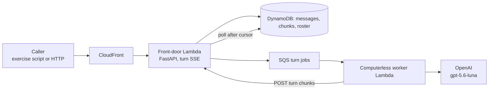
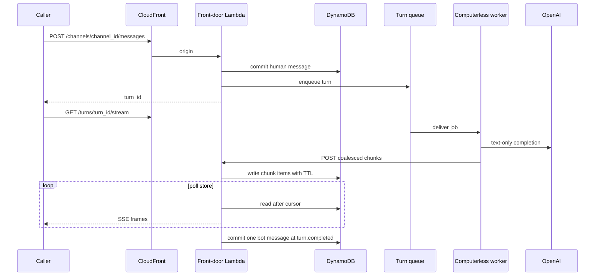
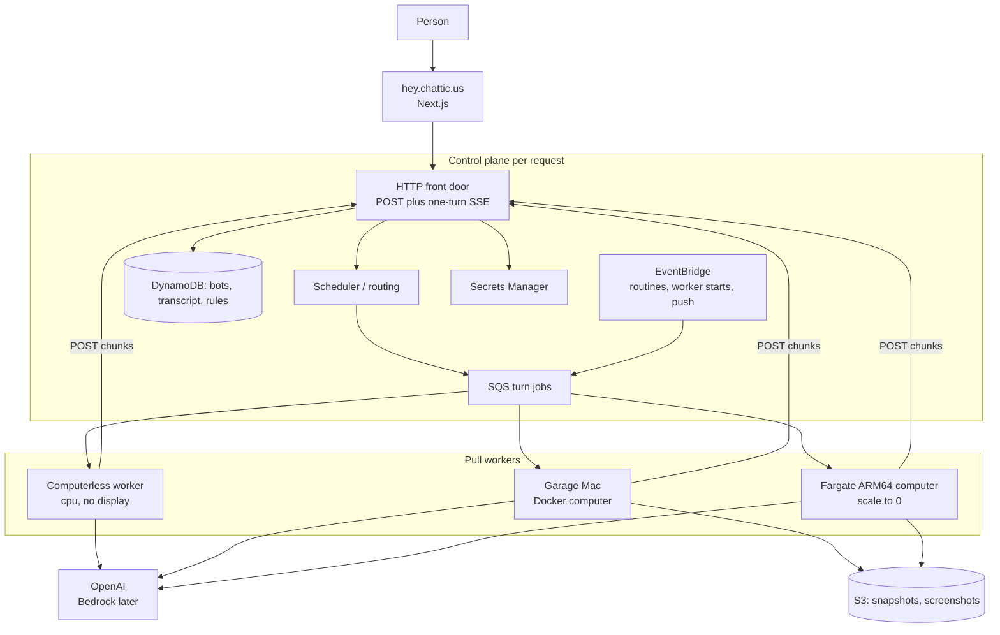

# Chatticus

**Shared spaces for people and bots.**

Chatticus is a shared, collaborative space where people and named bots
work together around common files, tools, and a system of authority and
approvals — like an office, not a chat window.

The production product workspace is [hey.chattic.us](https://hey.chattic.us).
The public marketing site, [chattic.us](https://chattic.us), is a separate
private repo (`AnthusAI/Chattic.us-web`) that depends on this repo's shared
UI kit and brand tokens; see the `exports` map in [package.json](package.json)
and Kanbus epic `chatticus-3926bc` for the public/private boundary.

v1 is personal: one household, one AWS account, as many named bots as we
want. Every record already carries a `tenant_id` so the same system can
later serve other people without a rewrite.

## Named teammates and one computer

A **bot** is a persistent, named teammate. It keeps memory, preferences, and
conversation. It is not a fresh chat session on every task.

A **computer** is a Linux workplace with a browser, a filesystem, and a
terminal. It belongs to a **user**, not to a bot. Every bot on that user
shares `/workspace`, browser sessions, and command-line credentials so they
can hand work off. Each bot gets its own screen so they can work in parallel.
Separate bots are not a security boundary.

Work prefers **structured tools** (APIs, MCP servers, connectors) when they
exist. The computer's browser is the fallback for sites and apps that have no
clean API.

A **skill** is how to do a task. A **routine** is when to run it (a schedule
or an event). **Approvals** stop consequential actions: sending, purchasing,
publishing, deleting, and production changes.

Closing your laptop does not stop work. The computer runs on a worker, not
on the device in front of you.

## How a turn works

A **turn** is one bot response: from a human message (or a routine) until
the control plane commits a single bot message to the transcript.

There are no persistent sockets. The browser **POSTs a message** and then
reads **server-sent events scoped to that one turn**. Reconnecting is a new
SSE request that reads already-committed chunks after `Last-Event-Id`.
In-process queues are not the architecture.

The **control plane** is the AWS side that accepts HTTP, stores tenant
state, and enqueues jobs. It does not run the model loop and it does not
own a display. It holds no always-on process in the token path, so when
nobody is working, nothing bills. That idle floor is the point: a quiet
household (and later, quiet tenants) should not pay for capacity that is
sitting empty. There is never a load balancer in front of the API; an
hourly LB charge would recreate the floor this design avoids.

**Pull workers** register, heartbeat, and take jobs from a queue. The
control plane never SSHs into a garage Mac. A worker that has CPU and
network but no display, browser, or `/workspace` is **computerless**.
Text-only turns can finish there. The computer is **summoned when a tool
needs it**, not assumed at enqueue: reaching for a display, browser, or
`/workspace` escalates the same turn onto a computer-capable worker. No
second transcript.

See [Architecture](docs/ARCHITECTURE.md) for routing,
[Messaging](docs/MESSAGING.md) for the transcript and stream, and
[Design challenges](docs/DESIGN_CHALLENGES.md) for rejected alternatives.

## What is live today

**Last updated: 2026-09-08.** Git **`develop`** is ahead of **`main`** (last
promote: #303). Principal enforcement (#7b4616), sign-out ending the SSO session
(#169), and the behavior-driven spec migration are on `main` and deployed across
all three named environments. Phase 1 org-computer work (#304, #306, #308) lands
on `develop` first and promotes to `main` for release.

### Deployed across environments

| Environment | ThinTurn API (enforcement) | Cognito Auth (sign-out) | Web bundle |
| --- | --- | --- | --- |
| development (`dev.chattic.us`) | Live — CloudFront → Lambda | Live — `logoutUrls` + `/auth/signout-callback` | Live — product `/chat` at `/` (CF enabled; marketing moved to `AnthusAI/Chattic.us-web`, chatticus-3926bc) |
| staging (`staging.chattic.us`) | Live — Lambda URL | Live — `logoutUrls` + callback | Deployed — S3 bundle staged, **CF dark by design** |
| production (`hey.chattic.us`) | Live — Lambda URL | Live — `logoutUrls` + callback | Deployed — S3 bundle staged, **CF dark by design** |

Staging and production thin-turn stacks may lag `develop`; their web front doors
stay dark until explicitly re-enabled and re-proven.

Every org route requires a Cognito `id_token` or worker bearer on all three
environments; only `/health` and `POST …/workers/register` (invoke-key gated)
are open. Live-verified on each environment: `/health` 200, `/me` 403, org
route 403 with no credential.

A seeded owner (`ryan@anth.us` → org `anthus`, display name Anthus AI
Solutions, enabled) can sign in with Google on development and reach the
workspace. Operator org records are DynamoDB data, not CDK; see
[Operator org seed](docs/OPERATOR_ORG_SEED.md).

### Live on development (beyond the table)

- **Operator org lifecycle HTTP** (#304): enable, suspend, and reinstate on
  development ThinTurn. Endpoints and auth are in
  [Operator org seed](docs/OPERATOR_ORG_SEED.md).
- **Customer cross-account template** (#308): `infra/customer-role.yml` is
  published at
  `https://dev.chattic.us/provisioning/customer-role.yml` (SSM:
  `/chatticus/development/provisioning/customer-role-template-url`). Runbook:
  [infra/README.md](infra/README.md). Staging and production hostnames stay
  CF-dark; do not treat their template URLs as a customer onboarding path yet.
- **Throwaway-account hand run** (`chatticus-b88c0a`): published template
  unmodified; F-safe `pong` completed on development. Timed runbook:
  [wiki](project/wiki/runbooks/throwaway-account-provisioning.md)
  (~19 min Chatticus provision; consumer AWS signup unmeasured). That
  figure **excludes** F-computer.
- **F-computer live refuse** (`chatticus-2f2d87`, closed): ComputerWorker
  assumed the customer role; missing customer `ChatticusComputers`;
  **zero `RunTask` in both accounts**. Kernel handoff ~5 s.
- **Customer-account `RunTask`** (`chatticus-82dab7`, #312–#315, closed):
  product `CreateStack` of `ChatticusComputers` in the customer account;
  lab-user customer `RunTask ≥ 1`.
- **Customer host executes `browser_open`** (`chatticus-8fe4c7`, #319, closed):
  kernel `about:blank` on development (labeled deviation from the customer
  UI). Journal `opened:about:blank`. Customer `RunTask` 1, Anthus 0. Host
  talks to Front Door HTTP only. Do not fold that elapsed time into the ~19 min
  provision figure.
- **Customer ECR holds `:dev`** (`chatticus-2b3c41`, #320, closed): task
  definition pulls from the organization AWS home. Operator
  `push-customer-computer-image.sh` published `:dev` under the assumed role
  (not Lambda). Anthus `ChatticusComputers` desiredCount stays 0. Live
  file-actions (2026-09-08) required a **repush** after host executor
  wiring; stale `:dev` failed with `HOST_IMAGE_STALE_CHROMIUM_EXECUTOR_ONLY`.
- **Agent workplace files survive host recycle** (`chatticus-863f27`,
  #324, closed): live on the throwaway org (kernel deviation). Write →
  customer-bucket publish → stop/start → read. Journal
  `persisted-by-agent-live-863f27`. Packs in
  `chatticus-snapshots-{ORGANIZATION_ID}`. Do not fold elapsed time into
  the ~19 min provision figure.

### On `develop`, not on `main`

- **Organization computer in the customer AWS home** (#306): host start routes
  through the org's recorded AWS account and cross-account role; same-account
  orgs use deployment credentials; unreachable customer roles refuse without
  Anthus fallback. Covered in Gherkin (`cross_account_provisioning.feature`,
  `computer_ecs_host_starter.feature`).
- **ECS host start** is wired on **development ThinTurn only**
  (`CHATTICUS_HOST_STARTER=ecs`). Staging and production ComputerWorker keep
  the no-op host starter.
- **Customer Fargate host on development** (#319): `computer_host_worker`
  uses Front Door `/host-worker/*` (no Dynamo on the customer task role).
  Live `browser_open` / `about:blank` completed on the ACME throwaway
  account. Staging and production ComputerWorker still use the no-op host
  starter. Image pull is the customer ECR `:dev` (#320).
- **Agent workplace files on host disk** (#318–#324, `chatticus-fccc4e9a`
  closed): Dynamo snapshot metadata, host hydrate/publish, host
  `read_workspace`/`write_workspace`, customer org bucket, and Gherkin
  that an agent file survives relocate
  (`computer_host_workspace_recycle.feature`). Live throwaway proof is
  under **Live on development** above. Do not `cdk deploy --all`.
- **Pending and enabled members see org name, status, and tenant_id**
  (#325, `chatticus-9c8dbf`): `GET /me` includes `name`; welcome and
  workspace list CloudFormation `OrganizationId` without the members CLI.
  Live on development after the web deploy from this merge.
- **Pending owners submit cross-account RoleArn in-product** (#326,
  `chatticus-070cb4`): `POST /orgs/{tenant_id}/self-setup/cross-account-role`.
  Live on development: inspect 422 when ExternalId does not match; 403
  without a user token. Operator enable stays break-glass without AWS
  home.
- **Enabled members create a named bot in the workspace** (#327,
  `chatticus-7622fd`): `CreateBotPanel` → `POST /bots` → roster refresh.
  Live on development: `LiveCreate` **200** and listed. Google SPA
  sign-in still blocks automated UI; HTTP path is live.
- **Human-started turns attach a household conversation grant** (#328,
  `chatticus-5336ff`): `read_workspace` and `write_workspace` on
  `/workspace` plus `approved_origin_fetch`. Live on development: human
  message to Ping HTTP 200; Dynamo turn grant matched the preset.
  `POST /bots` still attaches nothing until that first human message. No
  browse, send, purchase, or `run_terminal` in the preset.

### Public sites

| Host | Role | Notes |
| --- | --- | --- |
| [chattic.us](https://chattic.us) | Marketing (private `AnthusAI/Chattic.us-web` repo) | Updates, Agent Zoo, and the Markus wiki at `/wiki`; same-origin `/api` to this repo's thin-turn front door |
| [dev.chattic.us](https://dev.chattic.us) | Development product + API | Same-origin `/api`; product `/chat` at `/` |
| [hey.chattic.us](https://hey.chattic.us) | Production product (planned) | Web CloudFront **disabled** (stack exists, dark) |
| [staging.chattic.us](https://staging.chattic.us) | Staging (planned) | Web CloudFront **disabled** |

### Live acceptance gate

Live stack proof is manual: sign in at [dev.chattic.us](https://dev.chattic.us)
and send a message.

Named deploy workflows (`deploy-thinturn-development.yml`,
`deploy-web-development.yml`, `deploy-auth-development.yml`, and the matching
staging/production workflows) run on **push** to the environment branch
(`develop` for development; `main` for staging and production) and on
**`workflow_dispatch`**. GitHub Actions deploys to live AWS through OIDC
(`ChatticusGitHubDeploy` roles). Local `cdk deploy` via `infra/deploy-*.sh`
remains the fallback when CI cannot be used.

### Cloud stacks (do not destroy)

`ChatticusDns`, `ChatticusAuth`, `ChatticusWeb*` (development CF enabled; staging/
production CF disabled), `ChatticusThinTurn*`, `ChatticusSnapshots`, `ChatticusComputers`,
`ChatticusBudgets`. Never `cdk deploy --all`. Computers `desiredCount` stays **0**.

### Kernel-only on `develop` (not on live worker loop)

Overnight gated-action, immutable approval binding, unbound-browser stops, computer-seam
recovery, capability-gated readiness beyond waiting turns, and structured handoff journal
events are tested in Gherkin/pytest but not wired into the live worker HTTP loop yet.
See [Approval spec](docs/APPROVAL.md) and [Organizations](docs/ORGANIZATIONS.md).





## Where we are going

v1 is the product Next.js app at `hey.chattic.us` (production) talking to that same per-request control
plane, plus pull workers that can stay computerless or host the user's
Linux computer: local Docker when a Mac is on, Fargate ARM64 that scales
to zero when it is not. Workplace disk lives in S3 snapshots. EventBridge
will wake routines later. The model vendor is OpenAI; Amazon Bedrock may
follow.

Lambda is the right runtime for HTTP, auth callbacks, webhooks, routine
wake-ups, a computerless model loop, and holding **one turn's** SSE
stream. It is the wrong runtime for a workplace: it cannot hold a browser,
a display, or a session-lifetime connection. The computer is one Docker
image on Fargate, later stop/start EC2, or Docker on a Mac.



How a turn chooses a host:

1. A message or routine creates a turn job with `tenant_id`, required
   capabilities (`cpu`, and maybe `computer` / `browser` / `terminal`), and
   an optional `computer_id` pin.
2. Healthy workers pull. Prefer an already-warm cheap host (local Docker
   when the Mac is on), then a warm AWS computer, then a cold Fargate start.
3. The model loop runs **on the worker**, as soon as it has network and
   memory. Display, Chromium, and snapshot hydrate gate only the actions
   that need them.
4. Reaching for a computer tool escalates the same turn: the computerless
   attempt appends the pending tool call and a computer-capable worker
   continues. There is no `stop_computer`; the workplace is shared by all
   of a user's bots.
5. At `turn.completed` the control plane commits **one** message row.

## Persistence

Compute and disk are separate. The **computer** is a `computer_id`. The
**host** is whichever Mac, Fargate task, or EC2 instance is running it.

Canonical workplace disk (`/workspace` and the browser profile) is an **S3
snapshot**. Hosts hydrate a local cache, run, and publish. Relocate is an
administrator action: point the next host at that snapshot. There is no live
container move. See [Computer snapshots](docs/COMPUTER_SNAPSHOTS.md).

| State | Where it lives |
| --- | --- |
| Bot memory, skills, routines | DynamoDB |
| Transcript (append-only messages) | DynamoDB |
| In-flight turn chunks | DynamoDB, with a TTL; they expire after the turn commits |
| `/workspace` and browser profile | S3 snapshot; local volume / EBS / EFS as a host cache |
| Secrets | AWS Secrets Manager, never in the image |

Computer policy: `prefer_local`, `aws_only`, or `local_only`. Idle AWS
computers stop (EC2) or scale to 0 (Fargate). The snapshot stays.

## Repository

```
Chattic.us/
  features/                 Shared Gherkin (product narrative)
  python/                   Control plane, computerless and computer workers, snapshot packer
  web/                      Marketing (`/`) and product workspace (`/chat`)
  computer/                 Linux computer image
  infra/                    AWS CDK
  docs/                     Product, architecture, design challenges, stack
```

v1 language for the product brain is **Python**. The web app is
**TypeScript**. Gherkin in `features/` is the behavior spec. Root
`package.json` workspaces `web` and `infra` so one `npm install` at the
repo root installs all JavaScript dependencies (Node 22+).

## What you can run today

Local JavaScript setup (Node 22+):

```bash
npm install
npm run build
npm run test
npm run lint
npm run dev
```

Local quality gates (CI uses a fake OpenAI client; a live key is not
required):

```bash
cd python
python3 -m venv .venv
source .venv/bin/activate
pip install -e ".[dev]"
behave
pytest
black --check src ../features tests
ruff check src ../features tests
```

`black` and `ruff` versions are pinned in `python/pyproject.toml` so local
`pip install -e ".[dev]"` matches GitHub CI.

The deployed thin turn is exercised against a **named cloud environment**
(CloudFront on development only today), not against an in-process queue.
GitHub CI (`behave`, `pytest`) uses in-memory stores and moto. Live stack
proof is manual: sign in at [dev.chattic.us](https://dev.chattic.us) and
send a message.

Watch one live conversation as a human (tokens on stdout, committed reply
at the end). Workers use bearer tokens after registration. The product SPA
uses Google sign-in on development; scripts still use invoke key + worker
bearer until #7b4616 lands:

```bash
cd python
export CHATTICUS_INVOKE_KEY=...   # or pass --invoke-key
python scripts/chatticus_chat.py --environment development \
  --tenant-id anthus --user-id ryan --bot Luna --message "hello"
```

The script resolves the front door from `CHATTICUS_DEVELOPMENT_BASE_URL`,
SSM, or CloudFormation. Omit
`--message` for an interactive prompt. `--list-turns` calls
`GET /users/{user_id}/turns`; `--watch-turn` reconnects with
`Last-Event-ID` on `GET /turns/{id}/stream`.

That resolves the front door from `CHATTICUS_DEVELOPMENT_BASE_URL`, SSM
`/chatticus/development/thin-turn/cloudfront-url`, or the
`CloudFrontUrl` output on stack `ChatticusWeb` (or `ChatticusThinTurn`
before the web stack exists). When AWS lookup fails, pass `--base-url` or
set the env var (see gitignored `AGENTS.local.md`). SQS queue checks
need that same AWS identity. Staging and production web CloudFront is
disabled; use thin-turn stack outputs or `AGENTS.local.md` when you mean
those environments. It does not scale Fargate. Do not run this from
GitHub Actions.

If Docker Desktop is running, the snapshot packer can be checked with
`sh computer/test_relocate.sh`.

AWS resources are CDK only (`infra/`). Do not create them in the console.
`cdk deploy --all` would touch **ChatticusSnapshots**,
**ChatticusComputers**, and every thin-turn environment; never do that.
Deploy one named stack:

Deploy development ThinTurn only:

```bash
cd infra
sh deploy-chatticus-thinturn-development.sh
```

That fails closed without AWS identity and never passes `--all`. Staging
and production, when you mean those stacks:

```bash
npx cdk deploy ChatticusThinTurnStaging
npx cdk deploy ChatticusThinTurnProduction
```

**ChatticusThinTurn** is development. Staging and production are separate
stacks with their own DynamoDB, SQS, Lambda, and CloudFront (web CF
disabled on staging and production). Do not merge `develop` to `main` as
parking. Do not destroy the snapshot, computer, or budgets stacks.

Postgres in `docker-compose.yml` is unused (it predates DynamoDB).

## Task tracking

This repository uses [Kanbus](https://github.com/AnthusAI/Kanbus). Prefer
`kbs` when it is on `PATH`. See [CONTRIBUTING_AGENT.md](CONTRIBUTING_AGENT.md).

```bash
kbs list
kbs create "Describe the work" --type task
```

At **every milestone** (a slice merged to `develop`, a promote to `main`, a
deploy, a closed epic, or anything that changes what is true), **launch a
sub-agent** whose only job is housekeeping. That agent comments on the
Kanbus issues it touches, sets statuses to match reality, **creates new
issues** for significant work that appeared, and **rewrites the "What is
live today" section of this README** (and the next-up line) so a new reader
is not looking at last week's world. Do not skip that pass. Do not treat it
as a leftover for the implementation agent.

## Documentation

- [Product](docs/PRODUCT.md)
- [Architecture](docs/ARCHITECTURE.md)
- [Messages and the cloud API](docs/MESSAGING.md)
- [Design challenges](docs/DESIGN_CHALLENGES.md)
- [Computer snapshots](docs/COMPUTER_SNAPSHOTS.md)
- [Stack](docs/STACK.md)
- [Roadmap](docs/ROADMAP.md)
- [Approval spec](docs/APPROVAL.md)
- [Browser authority](docs/BROWSER_AUTHORITY.md)
- [Threat model](docs/THREAT_MODEL.md)
- [Tasks](docs/TASKS.md)
- [Feasibility tests](docs/FEASIBILITY_TESTS.md)
- [AGENTS.md](AGENTS.md) for coding agents working in this repo
