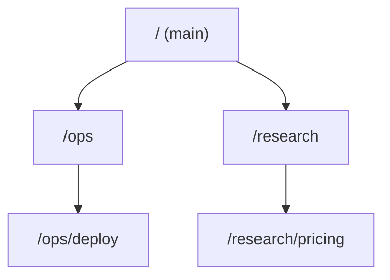

# Session namespace and handoff

Status: design only. No code exists for anything below. This records the
product owner's direction so the stories in Kanbus have one source.

Related: [Messaging](MESSAGING.md), [Voice](VOICE.md),
[Pi harness](PI_HARNESS.md), [Design challenges](DESIGN_CHALLENGES.md).

## What we want

A member talks to many bots. Each conversation is a **session** (the
existing channel: one conversation with its bot). Sessions need an order
the member and the bots can both understand, and a way for one bot to
bring the member to another bot without the bots messaging each other.

Four decisions follow from the direction:

1. Voice is locked to one session.
2. Sessions live in a hierarchical namespace of paths.
3. A bot hands the user to another session with a tool; bots do not talk
   to each other.
4. The list of sessions a bot may hand to is a context block rendered into
   each model call, not a tool.

## Rule: voice is locked to one session

> A voice session talks to the bot of the currently open session. There is
> no per-utterance routing. Never infer at speech time which bot a line is
> for.

This is how the code works now that the wake word is removed (see
[Voice](VOICE.md), section 1). Every completed line goes to the open
session's bot. The only way the target changes is that the open session
changes, and the voice session follows that change.

## The namespace

A session path is like a directory path: `/`, `/ops/deploy`,
`/research/pricing`. `/` is the root, the "main" session. Each path names
exactly one session, and each session has exactly one bot.

- A path is an attribute of the channel, not a new object. There is still
  no separate thread.
- Every channel row keeps `tenant_id`; paths are unique within a tenant
  (and within its organization), never globally.
- Directory levels group sessions. Whether a directory level is itself a
  session is open (see Open questions).
- Agents know the universe they work in: the directory block (below)
  tells each bot the paths it may hand the user to.



## Handoff, not bot-to-bot

Bots do not talk to each other. The namespace adds no inter-bot channel
(the "Bot to bot" section of [Messaging](MESSAGING.md) is unchanged and is
not what this feature uses). A bot connects the *user* to another session
by calling a tool.

### The tool

`connect_user(path)`. It is an ordinary tool in the tool model: schema
registered on every owner, committed as `tool.call` and `tool.result`,
keyed by action id. It needs no computer, so a computerless worker runs it.
Its result tells the model whether the path exists and the handoff was
recorded, or why not (unknown path, not permitted).

The tool does not move the user. It records an intent that the client acts
on. The model should end its turn with a short line ("Taking you to
deploy").

### The event

`turn.handoff` is a new event kind on the one-turn SSE stream. It fits the
existing vocabulary in [Messaging](MESSAGING.md), Events:

| Kind | When | Stored as a message? |
| --- | --- | --- |
| `turn.handoff` | The turn asked to connect the user to another session. `path` names the target | no, but recoverable (below) |

Body: `{ "path": "/ops/deploy", "channel_id": "...", "from_path": "..." }`.
The server resolves the path to a `channel_id` and checks permission before
emitting; the client never resolves paths.

### Persistence, so reconnect and refresh still see it

The stream is ephemeral and re-derivable from the store (the invariant in
[Messaging](MESSAGING.md)). The handoff must therefore be recoverable
without a live stream:

- The committed `tool.call` / `tool.result` pair for `connect_user` is the
  durable record. The `turn.handoff` event is derived from it, so it replays
  through `Last-Event-ID` like any other event.
- The turn's committed result row carries the handoff target, so a client
  that only reloads the channel (refresh, or the stream already closed)
  finds it.
- A handoff is acted on once. The client records the handoff's event id as
  handled so replays do not switch the user twice. A handoff older than the
  user's last explicit navigation is ignored, so a user who has moved on is
  not pulled back.

No socket is added. The one-turn stream is the carrier.

### Client behavior

On `turn.handoff` the client switches the open session to the target. The
voice session follows, by the locked-session rule: the open session changed,
so the voice target changed. Nothing about voice routing is decided per
utterance.

```mermaid
sequenceDiagram
  participant U as Member
  participant C as Client
  participant A as Bot at /
  participant S as Control plane
  U->>C: "take me to deploy"
  C->>S: message in open session
  S->>A: turn
  A->>S: tool.call connect_user(/ops/deploy)
  S-->>C: turn.handoff /ops/deploy (SSE)
  C->>C: open /ops/deploy; voice follows
```

## Directory as a context block, not a tool

The agent could be given a `list_sessions` tool. We choose not to: it costs
a round trip, and the model must know to call it. Instead the directory is
inserted into the model context on every turn: "Sessions you can connect
the user to: path, bot, purpose".

### The context-block mechanism

Generalize: a **context block** is

- a **name** (stable, used for ordering and caching),
- a **template** (Jinja-like, rendered to text),
- a **data provider** (a function from turn scope to template variables).

Blocks are evaluated **lazily, at the last moment**, when the prompt is
assembled for each model call, not when the turn is enqueued. A block
whose provider returns nothing renders to nothing and is omitted. Provider
data comes from our own stores and is escaped; templates are ours, not the
model's or the member's.

Other candidates: current date and member timezone, budget remaining, open
approvals. Only the directory is in scope for this epic.

## Prompt assembly order and caching

Provider prefix caching rewards a byte-identical prefix. Assembly order:

1. System prompt (stable).
2. Tool definitions (stable per bot).
3. Lazy context blocks, in a deterministic order (declared rank, then
   name), each rendering the same bytes when its data is unchanged.
4. Conversation tail (memory plus the channel's compacted view).

Rules: blocks sit after the stable prefix and before the tail; ordering
never depends on data; a block changes only when its content changes
(sorted entries, no timestamps, no per-call ids).

### Tradeoff: in the system prompt, or a late block

| | In the system prompt | Late block (after prefix, before tail) |
| --- | --- | --- |
| Cache | Any directory change invalidates the whole prefix, including tool definitions | System prompt and tools stay cached; only the block and tail are re-read |
| Authority | Models weight system text highly | Slightly lower, adequate for reference data |
| Simplicity | One string | Needs an assembly step (the mechanism provides it anyway) |
| Freshness | Same | Same |

**Recommendation: a late block.** The directory changes whenever a session
is created or renamed, far more often than the system prompt. Keeping it
out of the prefix preserves the cached system prompt and tools. The block
is stable between changes, so the tail still benefits from prefix caching
up to the block.

## Relation to pi-durable

See [Pi harness](PI_HARNESS.md).

- **Where blocks render.** Per model call, on the owner, where the harness
  builds the request, not at enqueue. A turn that continues on a second
  owner (the computerless-to-computer handoff) re-renders there; the
  deterministic order and unchanged data give the same bytes. Rendered text
  is not stored in the transcript. If auditability needs the exact prompt,
  record a content hash on `model.request`.
- **Tool model.** `connect_user` is a normal tool: registered on every owner
  so the model sees it from the first request, executed on a computerless
  owner, committed once. It only records intent, so replay is safe and
  idempotent on its action id.
- **Session per bot per channel.** The pi-durable conversation is the unit
  of storage. A session is one channel with one bot, so one session maps to
  one pi-durable conversation. A path is an index over those conversations,
  held beside the channel, not inside pi-durable. The conversation service
  resolves path to channel; Python keeps tenancy and permission.
- **Events.** `turn.handoff` joins `turn.waiting` and `approval.required` as
  a Chatticus event derived from our own documents (the committed
  `connect_user` result), not from a pi event.

## Open questions

Listed, not decided. The UX is worked out later.

- Rules for the main/root session: can it be renamed or removed, must it
  always exist, what is its bot, is it where an unrouted conversation starts.
- Who can create and rename paths: the member, a bot, an admin; and what
  happens to references when a path is renamed.
- Permissions and tenancy: which paths a bot may hand to, which a member
  may open; `tenant_id` stays required everywhere.
- What switching looks and sounds like in voice: a spoken cue, a chime, or
  silence.
- Whether the user must confirm a handoff: always, never, or by class.
- Going back up the namespace: a "back" or "up" action, and who owns it
  (client or a tool).
- A size limit on the directory block, and when a search tool becomes
  necessary because the block no longer fits.

## Build order

Tracked in Kanbus under the epic "Session namespace and handoff":

1. Namespace paths on channels.
2. The lazy context-block mechanism.
3. The session directory block.
4. The cache-aware prompt assembly order.
5. The handoff tool and `turn.handoff` event.
6. The client switching session on handoff, with voice following.

Behavior begins in `features/`; none of this is built before its scenario.
