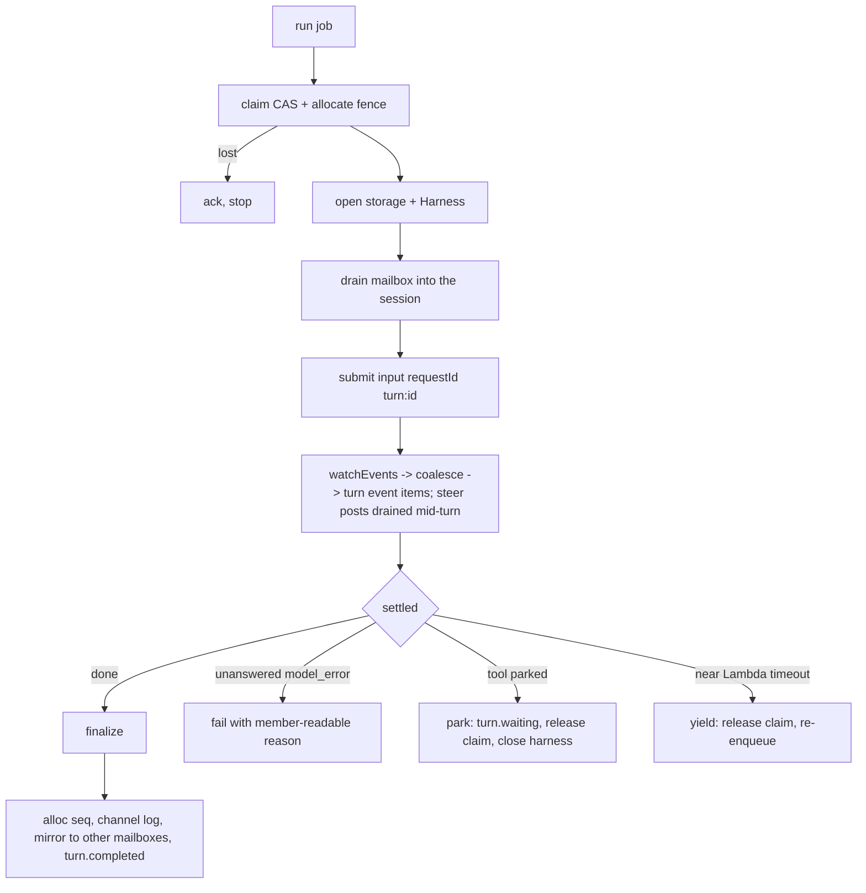

# TypeScript control plane

Status: design only. No code exists for anything below except what is
named as "on develop today". This is the plan for the one hard cutover
that moves the rest of the Python control plane to TypeScript on Pi.

Related: [Pi harness](PI_HARNESS.md), [Messaging](MESSAGING.md),
[Design challenges](DESIGN_CHALLENGES.md), [Voice](VOICE.md), and
`SESSION_NAMESPACE.md` (design branch `claude/session-namespace-design`, not
on develop; its path namespace is orthogonal and changes nothing here).

## Decisions already made (inputs, not up for debate)

- Chatticus moves to TypeScript to align with Pi. No new Python.
- One hard cutover moves everything that remains: auth, identity,
  organizations, membership, invitations, operator routes, `/me`, the spend
  ceiling; channels, messages, turns, the turn stream, voice messages; the
  worker protocol, the turn deadline, tasks, the capability policy, grants and
  approvals; the computer (host routes, computer start, the container host
  worker, snapshots). The Python front door and `ControlPlane` are then
  deleted. The waitlist and contact intake is not ported; it moves to a
  private repo.
- The Pi session (pi-durable, one per bot per channel) is the only transcript.
  Chatticus is the UI for Pi.
- Gherkin stays the spec and runs under cucumber-js with TypeScript steps.
- No parallel implementations, no backward compatibility, no fallbacks.
- Serverless rules stand: no sockets, the stream is scoped to one turn, no
  relational database, no load balancer.
- The web `/api` contract is preserved. Every deliberate change is listed in
  section 0.3.

## 0. Summary

### 0.1 The shape in six sentences

1. One Node 22 arm64 **FrontDoor** Lambda (Hono, response streaming on a
   Function URL) serves every HTTP route, including the one-turn SSE stream.
2. One **TurnExecutor** Lambda (SQS-triggered) is the Pi *owner* for exactly
   one turn at a time: it claims the turn, takes the storage fence, opens the
   bot's Pi session, runs, and closes.
3. A **TurnProbe** Lambda (SQS delay queue) replaces EventBridge Scheduler
   deadlines and drives recovery; a **ComputerStarter** Lambda starts the
   computer host.
4. Conversation content lives only in Pi sessions (S3 commit objects plus a
   DynamoDB index, the `conversation/` storage already on develop). Everything
   that a non-owner must write while no owner is live (turn control record,
   mailbox, events, organizations, policy, computer actions) is plain DynamoDB
   in the existing `Messaging` table layout.
5. The computer container runs a Node **host worker** that executes tool
   actions only. It never opens a Pi session. A parked computer tool is a
   durable *action* record; the host fills in its result over a nine-route
   HTTP protocol, and a normal executor resumes the Pi session.
6. About 40 small tickets, built dormant on develop, then one flip PR.

### 0.2 What is on develop today and is reused

- `conversation/src/storage/` : the production `IndexedStorage`
  (S3 commit objects plus a DynamoDB LSI index), `table-definition.ts`, and
  the fence methods. 23 of 23 storage conformance cases pass in CI against
  moto (`PI_HARNESS.md`).
- `conversation/src/budget/` : the budget rollup and alert recorder Lambdas'
  code and the vendor-ledger and rollup item codecs.
- `conversation/features-support/` : the cucumber-js foundation
  (`world.ts`, `hooks.ts`, a moto-backed table) and `features/ported-features.txt`,
  the manifest that excludes ported features from behave.
- Reference only, not on develop: commit `50efa62c` (prototype turn runner,
  Pi worker, SQS handler). Its good ideas are kept (per-turn `requestId`,
  `section()` system prompt, error classification); its channel sync through
  the front door is dropped because it made the front door a second
  transcript.

### 0.3 Web contract changes (every one is deliberate)

| # | Change | Why |
|---|---|---|
| 1 | `POST /channels/{id}/messages` addressed to a bot while that channel has an active turn **steers** the running turn instead of starting a second one. The POST returns `201` with the new `message` and the **same active `turn_id`**; no new turn record and no error. The turn's SSE stream continues unbroken and the steered message shows up in `GET .../messages` at its own `seq`. Unaddressed posts are always accepted as before. | One Pi owner per session, and Pi's `whenBusy: "steer"` places the message after the current tool round so the answer uses it (`PI_HARNESS.md`, measured). The iPad voice client's per-channel queue (`web/lib/voice-line-delivery.ts`) existed only to work around one turn at a time; it becomes redundant and is removed in the same cutover (ticket 40). |
| 2 | `turn.token` carries real incremental text, coalesced about every 250 ms, instead of two halves. Same event shape. | Pi streams; the old worker did one non-streaming call. |
| 3 | The committed bot message body is the **final** assistant text of the turn. Text the model streamed before a tool call is shown live but is not part of the committed message. | One model answer per turn is no longer true; the web already replaces the bubble with the committed message. |
| 4 | `turn.reconciling` is emitted only for (a) an uncertain Pi commit (`CommitOutcomeUnknown`) and (b) the stream idle timeout. Never for "provider outcome unknown": Pi simply retries the model call. | Pi makes provider ambiguity a non-event. |
| 5 | Worker-only routes disappear: `workers/{id}/heartbeat` (computerless), `turns/{id}/claim|renew|waiting|failed|resume|chunks`, `turns/{id}/browse/authorize`, `turns/{id}/tool/denied`, `bots/{id}/tasks/tool`. The executor is internal; these were never web calls. | No HTTP hop between the Lambda and itself. |
| 6 | The 21 host-worker routes become 9 (section 4.3). | The host runs actions, not turns. |
| 7 | No 256-token completion cap; Pi's defaults apply. | The cap was a Chat Completions parameter of the old worker. |
| 8 | `GET /channels/{id}/turn` and `.../turns/latest` keep their paths and return the turn of the channel's primary or addressed bot: the most recently started active turn (latest turn for `turns/latest`), 404 if none. A bot-specific variant is exposed for later use as the optional query parameter `?bot_id={bot}` on both paths (returns that bot's active or latest turn; the web does not send it yet). | Several bots can have active turns on one channel; the existing client must keep working unchanged. |

Unchanged on purpose: paths under `/api/orgs/{tenant}`, `/api/me`,
`/api/organizations`, `/api/health`; SSE frames `event:`/`id:`/`data:` with
integer `seq` per turn and `Last-Event-ID`; terminal kinds
`turn.completed|turn.failed|turn.reconciling`; 404 for no active or latest
turn; `{messages:[]}` with integer `seq`; `Idempotency-Key` on bots,
channels and voice messages (and accepted on message posts); `{detail}`
error bodies and the status mapping in `_status_for_error`.

## 1. Runtime layout

### 1.1 Lambdas

| Lambda | Trigger | Runtime | Memory / timeout | Why it exists |
|---|---|---|---|---|
| **FrontDoor** | Function URL, `RESPONSE_STREAM`, behind CloudFront `/api*` | Node 22 arm64, Hono | 512 MB / 900 s | All HTTP including SSE. Streaming needs a Function URL (no API Gateway, no load balancer). One function so CloudFront keeps one origin; 900 s is the stream lifetime limit, after which the client reconnects with `Last-Event-ID`. |
| **TurnExecutor** | SQS `TurnRuns`, batch 1 | Node 22 arm64 | 1024 MB / 300 s | The Pi owner. A turn's work must not depend on anyone watching (the invariant), so it is not inline in the request. Measured Pi owner memory is 160 MB; 1024 MB buys CPU. |
| **TurnProbe** | SQS `TurnProbes` (delay queue), batch 1 | Node 22 arm64 | 256 MB / 60 s | Deadline checks and recovery. See 3.5. |
| **ComputerStarter** | SQS `ComputerStartJobs`, batch 1 | Node 22 arm64 | 256 MB / 60 s | Starts the computer host (ECS `run_task`, cross-account assume-role). Cannot be the executor: it needs ECS/STS/CloudFormation permissions the executor must not hold. |
| DailyBudgetRollup, BudgetAlertRecorder | EventBridge Scheduler, SNS | Node 22 | exists in code on develop | Wiring status in infra to be confirmed by ticket 36. |
| IntegrationTest runner | schedule, on demand | Node 22 | 256 MB / 300 s | Black-box smoke over HTTP (port of `integration_test/`). |

Not Lambdas: no computer work runs on Lambda (a Lambda cannot hold a browser,
a display or a session-lifetime connection). The Node host worker runs in the
computer container (section 4).

### 1.2 Framework

**Hono** with `hono/aws-lambda` `streamHandle` and `hono/streaming`
`streamSSE`, validated bodies with **zod**. Reasons: it is ESM-native (Pi is
ESM only), tiny to bundle (the whole Pi owner path is already 0.7 to 2 MB
bundled), runs Lambda streaming without the Web Adapter layer, and its
`app.request()` lets cucumber-js drive the real routes in-process with no
sockets. Bundling is esbuild through CDK `NodejsFunction`
(`format: esm`, `target: node22`, the `createRequire` banner from the Pi
spike).

The Lambda Web Adapter layer, `run.sh`, Docker pip bundling and the
`SseSpike` stack are deleted.

Prototype needed (ticket 5): `streamHandle` plus `streamSSE` through a Function
URL and CloudFront with a 15 s heartbeat comment and abort on client
disconnect. The Python SSE worked through exactly this path, so the risk is
the Hono adapter, not the platform.

### 1.3 Inline versus queued turn execution

Queued. Inline execution would tie the turn to the POST or the stream
invocation; closing the laptop, a CloudFront timeout or a 900 s stream end
would then orphan work. SQS gives retry, a visibility timeout and a DLQ for
free, and SQS is explicitly for turn jobs (AGENTS.md). Cost of queueing: about
100 ms to first claim, invisible next to the model call.

A turn longer than a Lambda: the executor watches
`context.getRemainingTimeInMillis()`; under 30 s it **yields** (closes the
harness without aborting, releases the claim, re-enqueues itself). The next
owner resumes the same Pi session. This is the same mechanism as a crash
recovery and as the computer handoff, so there is one resume path.

### 1.4 Queues

| Queue | Producer | Consumer | Notes |
|---|---|---|---|
| `TurnRuns` + DLQ | FrontDoor (post), TurnProbe (recovery), FrontDoor host result route (resume) | TurnExecutor | Message `{kind:"run", tenant_id, turn_id, bot_id, enqueue_id}`. Visibility 1800 s (6x function timeout, AWS guidance). New name; old `TurnJobs` is drained and deleted at cutover so payload schemas never mix. |
| `TurnProbes` + DLQ | FrontDoor, TurnExecutor, TurnProbe | TurnProbe | `DelaySeconds` up to 900 s; every probe is self-checking so no cancel is needed. |
| `ComputerStartJobs` + DLQ | TurnExecutor (park), TurnProbe (action unclaimed too long) | ComputerStarter | Message `{tenant_id, computer_id, action_id}`. |

EventBridge Scheduler (per-turn one-shot schedules, the schedule group, its
role and PassRole) is removed from the turn path. Deadlines are SQS delay
messages. Reason: Python created, updated and deleted a schedule on every
lease renewal; a self-checking delayed message removes all of that and removes
a class of IAM. EventBridge Scheduler stays for the budget rollup cron.

## 2. Data model

### 2.1 The split, stated once

> Pi holds what was said and done. DynamoDB holds who is allowed, what is
> running, and what is waiting.

| Lives in Pi (the only transcript) | Lives in plain DynamoDB |
|---|---|
| Every message in a bot's view of a channel: human, other bots (attributed), the bot's own replies | Organizations, membership, identity, invitations, org-creation caps |
| Model requests and answers, thinking, usage (`pi.usage`) | Channels (metadata, participants, roster), bots (names, memory), tasks |
| Tool calls and tool results (entries, `pi.tool` tasks) | The **turn control record** (status, attempt, lease, deadline, waiting gate, fence, terminal reason) |
| The per-session channel log (section 2.4) | Turn events (ephemeral progress view, TTL) |
| Compaction (Pi's own) | The mailbox (inbound messages awaiting drain) |
|  | Grants, approvals, auto-review rules, authorized connections, capability policy |
|  | Workers and credentials, computers, computer actions, snapshot metadata |
|  | Vendor ledger, budget rollups |

### 2.2 Why the turn control record is not in Pi

The record must be written by processes that are not the Pi owner and while
no owner is live: the FrontDoor creates it when a message is posted, the
TurnProbe reassigns it when an owner dies, the host result route un-parks it.
Pi allows exactly one writer per storage (fenced). Putting the record in a Pi
document would force every one of those writers to claim a fence first, which
is the owner-free-admission path `PI_HARNESS.md` left open. A conditional
DynamoDB item is the right tool for compare-and-set control state. It carries
no message text, so it is not a second transcript. The final answer text
exists once, in the Pi session.

### 2.3 Tables and buckets

| Resource | Contents |
|---|---|
| `Messaging` table (existing, unchanged schema, `pk`/`sk`, TTL `expires_at`) | All plain items below. Schemas for organizations, membership, identity, invitations, workers, computers, bots, tasks, idempotency, vendor ledger and budget rollups are **frozen as they are** (the budget port already reads and writes them from TypeScript). |
| `Conversations` table (new, PAY_PER_REQUEST, three LSIs from `table-definition.ts`) | Pi session index, `pk = PI#<tenant>#<bot>#<channel>`. Must be a separate table: LSIs exist only at creation. Removal policy RETAIN outside development. |
| `PiSessions` bucket (new) | Immutable commit objects. Block public access, SSL enforced, versioning off, **no expiry lifecycle on `commits/` or `segments/`**. |
| `ChatticusSnapshots` bucket (existing stack) | Computer snapshot packs, unchanged. |

New or changed items in `Messaging` (all keys carry the tenant):

| Item | pk / sk | Notes |
|---|---|---|
| Channel meta | `{t}#channel#{id}` / `meta` | As today; `next_seq` becomes the atomic message-seq allocator (`ADD`). |
| Channel lookup, roster index, channel idempotency | unchanged | |
| Active-turn and latest-turn pointers | `{t}#channel#{id}` / `active_turn#{bot_id}`, `latest_turn#{bot_id}`, plus `active_turn_primary`, `latest_turn_primary` | The pointer is per (channel, bot): each bot has its own Pi session, so a channel can have several active turns, one per bot. `active_turn#{bot_id}` is a conditional put, which enforces one active turn per bot per channel. `*_primary` hold the most recently started active turn and the latest turn across bots, for the unchanged web paths (0.3 change 8). |
| Turn control record | `{t}#turn#{id}` / `meta` | New field set, section 3.1. |
| Turn event | `{t}#turn#{id}` / `evt#{seq:010d}` | Same key shape, TTL 24 h. |
| Turn grant | `{t}#turn#{id}` / `grant` | Unchanged. |
| Mailbox | `MB#{tenant}#{bot}#{channel}` / `{seq:010d}` | New, section 2.5. No TTL (it is a queue, drained and deleted). |
| Computer action | `{t}#computer#actions` / `act#{action_id}` and turn index `{t}#turn#{id}` / `act#{call_id}` | New, section 4.4. |
| Fence counter | stored in the Pi table's own `OWNER` item | Section 3.2. |

**Dropped** at cutover (stay in place for 14 days as rollback insurance, then
purged by the follow-up to ticket 40): message items `msg#`, old-shape turn items, chunk items,
the Python-shape event items. **Not read, not written, not migrated**:
`WAITLIST`, `CONTACT` items.

### 2.4 Channels, bots and sessions

- A **channel** is metadata plus the participant list. Participants are humans
  (one or more) and bots. There is no thread object.
- A **session** is one Pi storage per (tenant, bot, channel):
  `storageId = "<tenant>#<bot>#<channel>"`, root conversation only.
  A direct channel has one session. A named channel with three bots has three
  sessions.
- Every bot on a channel reads the channel; only the addressed bot acts. In Pi
  terms: every committed channel message reaches **every** participating bot's
  session; only the addressed bot's session gets a model run.
  - the addressed bot's session receives it as an `input` submission;
  - every other bot's session receives it as a `write` entry (a user-role
    entry attributed to its author, no model call).
- A bot's own reply is an assistant entry in its own session. At finalization
  it is mirrored to the other bots' mailboxes as an attributed message.
- Bot memory stays on the bot item and is rendered into each model call as a
  Pi `section()` (live, not stored in the transcript), exactly the prototype's
  `buildSystemPrompt`.

**The per-session channel log.** Each session carries one Pi conversation
document, `chatticus.channel-log` (scope `conversation`, history `latest`),
whose value is an ordered list of
`{seq, messageId, authorKind, authorId, addressedToBotId, createdAt, entryId}`.
It holds metadata and a pointer to the Pi entry that holds the body; it never
holds message text. It is updated in the same commit as the entry where the
commit is ours (`write` entries), and by an idempotent reconcile at owner
open where Pi commits the entry internally (`input` submissions). This is the
cheap, ordered index the message list needs; scanning raw entries would read an
S3 object per tool result.

Prototype needed (ticket 15): confirm the document, the `write` entry draft
shape and an idempotent reconcile alongside `submit({type:"input"})`; confirm
a read-only `createSession(storage)` can read the document and entries while
another owner holds the fence. Fallback if a read-only session is not safe:
the executor publishes the log to a plain DynamoDB item per commit. Do not
adopt the fallback without the prototype failing.

### 2.5 How a human message enters a session (the mailbox)

Non-owners cannot commit to a Pi storage. So every inbound channel message
takes the same single path:

```mermaid
sequenceDiagram
  participant W as Web
  participant FD as FrontDoor
  participant DB as Messaging
  participant SQS as TurnRuns
  participant EX as TurnExecutor
  participant PI as Pi session (addressed bot)

  W->>FD: POST /channels/{id}/messages
  FD->>DB: ADD next_seq (idempotency key checked first)
  FD->>DB: put mailbox item for each bot session
  FD->>DB: put turn control record + active_turn#bot pointer (if addressed and that bot has no active turn)
  FD->>SQS: run job; probe job (new turn only)
  FD-->>W: {message, turn_id}
  SQS->>EX: run
  EX->>DB: claim turn (CAS), allocate fence
  EX->>PI: open; drain mailbox in seq order
  Note over EX,PI: addressed message becomes input submission<br/>others become write entries. requestId = msg:{messageId}
  EX->>DB: delete drained mailbox items
```

- **A second post addressed to the SAME bot during that bot's active turn
  steers.** A post addressed to a *different* bot does not steer: it takes the
  ordinary path and starts that bot's own turn immediately (its own
  `active_turn#{bot_id}` conditional put), so several turns can run on one
  channel at once, each in its own Pi session. The FrontDoor
  allocates `seq` and writes the mailbox item exactly as above, but creates no
  turn: a `TransactWrite` puts the mailbox item under a condition that the
  addressed bot's active turn record (found through `active_turn#{bot_id}`) is
  `active` and not `closing`, and the response carries
  the existing `turn_id`. The owner drains the mailbox while the turn runs (at
  every tool-round boundary seen on `watchEvents` and at least every 2 s) and
  calls `submit({type:"input", whenBusy:"steer", requestId:"msg:"+messageId})`.
  Finalize first sets `closing` on the turn record (conditional on
  `attempt_id`), then drains once more; any addressed item found is steered in
  and the turn keeps running, so no steered message is stranded. A post that
  loses the race against `closing` fails the condition and takes the ordinary
  new-turn path, which waits for that bot's `active_turn#{bot_id}` pointer to clear and then
  creates the next turn.
- `requestId = "msg:" + messageId` makes the drain idempotent (a crash between
  commit and delete just re-drains to the same submission).
- A session that has no turn keeps its mailbox until its next owner opens it.
  This is the lazy per-session sync: the first thing every owner does is bring
  the session up to the channel.
- Mailbox items for the *same* message are written before the turn record, so a
  claim can never find a prompt message that is not yet durable.

### 2.6 Serving `GET /channels/{id}/messages` with integer `seq` from Pi

1. Load channel meta (participants).
2. For each participating bot session: read the channel log (document) and list
   that bot's mailbox. Filter by `seq > after` before fetching any body.
3. Merge by `seq`, dedupe by `seq` (a human message appears in every session;
   a bot reply is authoritative in its author's session; a mailbox item is
   authoritative only until it is drained).
4. Fetch bodies from the referenced Pi entries (parallel; commit objects are
   immutable so the FrontDoor keeps an in-memory LRU keyed by object key).
5. Return `{messages:[{message_id, channel_id, tenant_id, seq, author_kind,
   author_id, body, addressed_to_bot_id, created_at}]}`.

`seq` is allocated once, at the moment a message first exists: by the
FrontDoor for human (and API-posted bot) messages, by the executor at turn
completion for the bot's reply. The allocator is one atomic `ADD` on the
channel item, so order is total across all sessions and gaps (a failed turn
that never allocated) cannot occur. Cost: a long conversation costs one
document read plus body fetches per listing. Mitigation is the LRU, the `after`
query parameter (reconnect), and the session **snapshot objects** of ticket 37
(a prerequisite for staging and production, not for development).

### 2.7 Migration from the current layout

| Environment | Plan |
|---|---|
| **development** | Free. Wipe `Messaging` conversation items; deploy fresh. |
| **staging**, **production** | Real data. Transcript migration tool (ticket 38), idempotent, online-safe until the flip. |

Tool phases:

1. **copy** (any time before the flip, repeatable, additive; Python keeps
   serving): for every channel and every bot participant, claim a fence, replay
   the old messages in `seq` order into that session. Human messages become
   user entries; the session's own bot's messages become assistant entries
   (a synthetic assistant message: provider `openai`, model `migrated`,
   stopReason `stop`, zero usage); other bots' messages become attributed
   user entries. The channel log is written with the **original** `seq`,
   `message_id` and `created_at`; the channel's `next_seq` is untouched.
   `requestId = "migrate:" + messageId`; a `MIGRATED#` marker per
   (channel, session) lets reruns skip.
2. **latest turn** per channel is rewritten into the new turn-record shape
   (status, terminal reason, prompt seq) so reload after the flip still shows a
   failed turn.
3. **flip** (the final PR): the new FrontDoor starts in `MIGRATING` (a state
   item) and answers every write route with 503 until phase 4 ends.
4. **delta then verify**: copy messages with `seq` above the last copied, then
   verify per channel that the set of `seq` values and the body hashes equal
   the old items. Set the state item to `OPEN`.
5. **rollback** until day 14: revert the flip commit and redeploy (the
   Python tree is in git; old items are untouched). After day 14 the purge
   follow-up of ticket 40 deletes the old items.

Pre-flight (a scripted check in the flip PR): no active turns, `TurnJobs`
and `ComputerTurnJobs` empty, no host start in flight.

## 3. Turn lifecycle on Pi

### 3.1 The turn control record

`{t}#turn#{id}` / `meta`:
`turn_id, tenant_id, channel_id, bot_id, status (active|completed|failed|reconciling),
prompt_message_seq, attempt_id, attempt (int), claimed_by, lease_expires_at,
deadline_at, recovery_attempts, waiting_for, storage_fence, next_event_seq,
terminal_reason, message_seq, ledger_input_recorded, ledger_output_recorded,
logical_enqueue_ids`. "Waiting" is still `active` with `waiting_for` set,
as today.

### 3.2 Claim and fence

The turn's fence **is** the Pi storage fence, one number per session:

1. **Claim (CAS on the turn record)**: status `active`, no `waiting_for`, and
   (no lease or lease expired); set `attempt_id`, `attempt = attempt + 1`,
   `lease_expires_at = now + 60 s`, `deadline_at`. Condition failure means a
   live owner exists: ack the SQS message and stop. This is the Python
   `claim_turn_attempt` CAS, ported.
2. **Allocate the Pi fence**: `UpdateItem` on the session's `OWNER` item,
   `SET fence = if_not_exists(fence, 0) + 1`, returning the new value
   (`IndexedStorage.allocateFence`, a new static beside `claimOwnership`).
   It is done *after* the CAS so a duplicate delivery can never raise the
   fence under a live owner. A stale owner is fenced out by this step, which
   is the desired effect.
3. Record `storage_fence` on the turn, open `IndexedStorage` with that fence,
   `Harness.open`, run.
4. **Renew** every 20 s (CAS on `attempt_id`). A failed renew or an
   `OwnershipLost` means this owner is stale: close the harness and return
   without writing a terminal state (a stale `submission.wait()` never
   settles, so the executor must close it itself).

`CommitOutcomeUnknown` is the one fatal storage error: the executor marks the
turn `reconciling` (3.6) and stops.

### 3.3 One execution, end to end



Steering: while the turn runs, the executor also drains mailbox items that
arrived after the first drain (section 2.5) and submits each with
`whenBusy: "steer"`. The turn's single `turn_id`, SSE stream and committed reply
cover the steered messages too; the reply is one final assistant text (change 3).

`runTurn` is the prototype's: `Harness.open` with `settings.retry`, one root
conversation, `root.submit({type:"input", content, requestId:"turn:"+turnId})`
(a re-run after a crash returns the same submission; no double prompt),
`await submission.wait`. Differences from the prototype: the channel arrives
through the mailbox drain (not the front door), and the answer is read from the
settled submission instead of re-parsing.

Finalize (one fenced step, idempotent under a conditional update on
`status = active AND attempt_id = mine`): allocate the reply `seq`, append the
channel-log line, write the reply to the other bots' mailboxes, set the turn
`completed` with `message_seq`, append `turn.completed {message_seq, body}`,
delete the `active_turn#{bot_id}` pointer (and `active_turn_primary` if it names this turn), record spend (3.7).

Failure classification keeps the Python mapping
(`worker/model_provider_errors.py`): permanent provider errors
(`insufficient_quota`, 401, 403, 400/404) fail the turn with the readable
reason; temporary ones are Pi's retry policy (`maxRetries 2`) and, past that,
an SQS retry. The mapping runs on the settled submission's `unanswered`
reason and detail.

### 3.4 SSE derived from `watchEvents`

`watchEvents` is live-only (a late joiner gets a snapshot, nothing is
replayed), and there is no cross-process live watch. So the **executor** is the
one `watchEvents` consumer, and it writes the result as durable turn event items
that the FrontDoor streams. That keeps the invariant (the stream is a view,
re-derivable from the store) and keeps integer `seq` and `Last-Event-ID`
trivially.

| Pi event | Turn event kind and fields |
|---|---|
| (FrontDoor at post) | `turn.started` (seq 1) |
| (executor after claim) | `attempt.claimed {attempt_id}` |
| `turn_start` | `model.request {attempt_id}` |
| `message_update` text deltas | `turn.token {token}`; coalesced, flushed about every 250 ms or 200 bytes |
| `tool_execution_start` | `tool.call {body: tool name, action_id: callId}` |
| `tool_execution_end` | `tool.result {body, action_id}` |
| park | `turn.waiting {body: gate, pending_computer_tool}` |
| yield, release | `attempt.relinquished {attempt_id}` |
| finalize | `turn.completed {message_seq, body}` |
| failure | `turn.failed {body: reason}` |
| uncertain commit | `turn.reconciling {body}` |

Thinking deltas are not forwarded. `snapshot`, `inbox_update` and the rest are
ignored.

Event writes are `TransactWriteItems` of `[ConditionCheck turn.attempt_id =
mine, Put evt#{seq}]` (two items), so a stale owner cannot append. The
executor owns `seq` locally; on a resume it starts at the highest existing seq
plus one (one Query). Events have a 24 h TTL.

**The stream route** (FrontDoor): authenticate once at open; load the turn;
cursor = `Last-Event-ID` (a non-numeric value is 400, as today); poll
`evt#` items after the cursor with backoff 50 ms to 1 s; frames
`event: <kind>\nid: <seq>\ndata: <json>\n\n`; `: heartbeat` comment every 15 s;
close after a terminal kind; at 600 s idle with the turn not parked, emit the
synthetic `turn.reconciling`; end before the Lambda limit and let the client
reconnect. If `Last-Event-ID` is past the stored events and the turn is
terminal (TTL expired), synthesize the single terminal event from the turn
record. The 15-minute stream limit is already covered by the web's
reconnect logic (`EnabledWorkspace.tsx`, four retries with backoff).

A new scenario, `features/turn_stream_replay.feature`, covers reconnect
with `Last-Event-ID`, because no test covers it today.

### 3.5 Deadlines and recovery

A **probe** is an SQS message `{tenant_id, turn_id, kind: "deadline", expect_attempt}`
delayed by the lease or deadline interval.

| Probe fires, and | Action |
|---|---|
| turn terminal | drop |
| lease valid | re-send itself with the remaining delay |
| turn `waiting_for` set and within the waiting limit (15 min) | re-send |
| waiting past the limit | fail "computer unavailable" |
| lease expired, attempts left | `recovery_attempts + 1`, clear claim, enqueue a run (dedupe by `logical_enqueue_id(turn, n)`, ported) |
| lease expired, Pi session shows the submission `done` | finalize as completed (the owner died after the answer, before finalize) |
| lease expired, none left | fail `recovery attempts exhausted` |

Default lease 60 s, deadline 120 s, one recovery attempt, as Python. Recovery
is a plain resume: the next owner reopens the session; Pi resubmits an
interrupted model call, reruns `replay: "safe"` tools and gives the model an
"interrupted" result for unsafe ones (`PI_HARNESS.md`). That makes the Python
"ambiguous provider call" machinery unnecessary.

Ported fault injection (`turn_fault_hooks`, crash windows) becomes an
executor option `faults?: FaultPlan` so `turn_fault_injection.feature` and the
recovery scenarios keep their steps.

### 3.6 Voice understanding

`POST /channels/{id}/voice-messages` is a FrontDoor route, unchanged in
contract. The understand-the-user step is a **single non-durable model call**
(gpt-5-nano, minimal reasoning, JSON), not a Pi turn: no session, no fence.
Inputs: the transcript plus the ten most recent messages from the message list
(2.6, limited to ten after the seq cursor), speaker labelled. Participant
checks run before the paid call; replay by `Idempotency-Key` returns the earlier
result with `degraded:false`; a filler-only line posts nothing; any other empty
result posts the heard line (the VOICE.md rules, ported with
`voice/understanding.py` and `features/voice_messages.feature`). Spend is
recorded as a ledger row with `turn_id = "voice:<uuid>"` exactly as now. The
resulting message then takes the ordinary admission path (2.5).

Prototype needed (ticket 22): the pi-ai call shape for a one-shot completion
outside a Harness (or, if awkward, the `openai` package that pi-ai already
depends on). The model id and prompt are unchanged.

### 3.7 Spend recording

Pi already meters (`pi.usage`, per model, with token counts). The ledger keeps
its frozen schema and its own write-time prices (`vendor_prices`), so the
rollup's `input_price_per_million_usd` and `cost_usd` stay consistent. At
finalize and at every terminal failure the executor reads `pi.usage` for the
session, takes the delta over `ledger_input_recorded`/`ledger_output_recorded`
on the turn record, writes the ledger row (`accumulate`), and advances those
two fields in one conditional update. A recovered attempt therefore never
double-counts. Computer-work pausing by spend ceiling is checked when a
computer action is created (4.4), as in Python's `prepare_computer_tool`.

## 4. The computer

### 4.1 What moves, what stays

| Item | Decision |
|---|---|
| Container base | `node:22-bookworm-slim` plus `xvfb x11-utils chromium fonts-liberation`. Same image runs on Fargate, EC2 and local Docker. No Python in the image. |
| Host worker | A bundled Node program, `node /opt/chatticus/host/host-worker.mjs`, from `computer/host/` (new workspace package). Replaces `python -m chatticus.computer_host_worker`; `CHATTICUS_ECS_HOST_COMMAND` changes with it. |
| Snapshots | `python -m chatticus.snapshot pack|hydrate` becomes `node /opt/chatticus/host/snapshot.mjs pack|hydrate` (entrypoint smoke, `test_fargate.sh`, `test_relocate.sh`). Pack, store, S3 adapter, host cache and URI rules ported from `python/src/chatticus/snapshot/`. The host talks to S3 directly, as today. |
| Executors | Workspace files, terminal (`/bin/sh`), Chromium; browser profiles; workspace path mapping: ported 1:1. |
| Image push scripts | Unchanged. |

### 4.2 Why the host does not run Pi

An organization's computer can live in the **customer's AWS account**
(assume-role, `ChatticusOrganizationComputerRole`). That account must not hold
write access to Chatticus's transcript store. Today the host already reaches
the control plane only over HTTP plus its own snapshot bucket. This design
keeps that boundary: the host executes tool actions; the Lambda owner
(Chatticus account) is always the only Pi writer. It also avoids loading Pi
and AWS credentials for the conversation tables into a container that runs
model-chosen shell commands.

### 4.3 Host protocol: 21 routes become 9

All under `/orgs/{tenant}/host/...`, bearer worker token (from
`POST /orgs/{tenant}/workers/register`, invoke-key bootstrap, as today),
`X-Chatticus-Host-User-Id` kept. Zod schemas live in a shared
`host-protocol/` package imported by both the FrontDoor and the host, so the
wire cannot drift.

| # | Route | Replaces |
|---|---|---|
| 1 | `GET /computer` | computer, readiness, stopped read |
| 2 | `POST /computer/state` `{stopped?, capability_ready?}` | stopped, capabilities/{c}/ready |
| 3 | `POST /snapshot/hydrated` | same |
| 4 | `POST /snapshot/published` | publish (the host packs and uploads, then reports the URI) |
| 5 | `POST /actions/claim` | list_active_turns, turn, escalation/ensure, unresolved-actions, attempt-claimed, computer/claim, expire-orphaned: **one call** returns the next pending action for this org (or none) and a lease |
| 6 | `POST /actions/{id}/renew` | lease extension |
| 7 | `POST /actions/{id}/result` `{result \| error}` | tool-result, execute-pending, complete |
| 8 | `POST /actions/{id}/regate` `{kind: browse\|read\|write, target}` | browse/regate, workspace/read/regate, workspace/write/regate, browser-context, capability-policy |
| 9 | `POST /heartbeat` | worker heartbeat |

The reduction is possible because the policy decision moves to where the data
is: the executor (Lambda) evaluates the grant, ceiling and approval **before**
it creates the action, and writes the allowed envelope (paths, origins, tool,
arguments) into the action item. The host enforces the envelope; only a
navigation to an unforeseen origin needs route 8. Regate is evaluated against
the same policy kernel the executor used.

### 4.4 The parked-tool handoff (Lambda owner to computer)

The Pi spike parked a tool by closing the owner and relying on crash replay,
which left "A parked" indistinguishable from "B crashed mid-execution". Here
the ambiguity is removed with an explicit, durable **computer action** keyed by
the Pi tool call id.

Computer tools (`read_workspace`, `write_workspace`, `run_terminal`, `browse`,
`request_computer_capability`) are registered on **every** owner with identical
schemas and are declared `replay: "safe"`, because their `execute` is a
*lookup-or-park* and is idempotent by construction:

```
execute(args, api):
  action = actions.byCall(turn, api.callId)
  if action.done:  return action.result            // the effect already happened on the host
  if no action:    decide(policy, ceiling, approval)
                   denied -> return denial result
                   spend ceiling -> return "computer work paused" result
                   create action(requested, envelope)
  park()           // signals the executor; awaits abort; never completes
```

On `park()` the executor: sets `waiting_for = gate`, appends `turn.waiting`,
enqueues `ComputerStartJobs` (if the computer's host is not live), releases
the claim and closes the harness **without aborting**. The `pi.tool` task stays
at its `execute` checkpoint; the generation stays `waiting` on `tools`.

```mermaid
sequenceDiagram
  participant EX as TurnExecutor (owner A)
  participant DB as Messaging
  participant CS as ComputerStarter
  participant H as Host worker
  participant FD as FrontDoor
  participant EX2 as TurnExecutor (owner B)

  EX->>DB: create action (requested) + envelope
  EX->>DB: turn waiting_for = workspace; release claim
  EX->>CS: ComputerStartJobs (if no live host)
  CS->>H: ECS run_task / assume-role
  H->>FD: POST /actions/claim
  FD-->>H: action + envelope + lease
  H->>H: execute tool on the live disk
  H->>FD: POST /actions/{id}/result
  FD->>DB: action done; turn active, unclaimed
  FD->>EX2: TurnRuns run job
  EX2->>EX2: claim, new fence, open session
  EX2->>EX2: pi.tool resumes; execute finds result
  EX2->>EX2: generation continues to the answer
```

Host crash mid-action: the action is `claimed` with a lease. A probe finds it
expired. For tools whose envelope says `idempotent` (reads, `browse` GET) the
action returns to `requested`; for the others (`write_workspace`,
`run_terminal`) it is completed with the error result "interrupted and may
have partially run", the same message Pi uses for unsafe replay, and the turn
resumes. A computer that never claims an action is probed again (re-enqueue
start) until the waiting limit.

The computer is shared by the whole organization, so actions queue per
computer. There is still no `stop_computer`. Host stop is the existing
`set_computer_stopped` through route 2.

### 4.5 Computer start

ComputerStarter is the old `ComputerWorker` Lambda without turn logic: it
deduplicates by `host_start_generation` (the existing lease), assumes the
cross-account role when the organization is in its own account, and calls ECS
`run_task` (command override from the infra env). It deletes the SQS message on
success and returns an item failure only when it could not start. The host
discovers work by claiming actions on boot, so there is no start-to-turn
coupling. Customer-account provisioning, the CloudFormation template asset
(moved into `infra/`) and the snapshot bucket naming are ported mechanically.

### 4.6 Host worker internals (Node)

`computer/host/src/`: `main.ts` (loop and shutdown: hydrate on boot, run until
the deadline, publish before exit), `boot.ts` (capability readiness gates),
`protocol-client.ts` (the nine routes, `fetch`), `executors/{workspace,terminal,chromium}.ts`,
`browser-profiles.ts`, `workspace-paths.ts`, `snapshot/*`. `ChatticusWorker`
no longer exists: the loop is "claim, execute, report".

## 5. Auth

| Concern | Decision |
|---|---|
| Cognito `id_token` | **`aws-jwt-verify`** (`CognitoJwtVerifier`, `tokenUse: "id"`; user pool id and client id from SSM, cached per container). Reason: the AWS-maintained verifier, JWKS caching built in, minimal dependencies. Identity stays **email-keyed**: the verified, `email_verified` email claim is the key; `sub` is never trusted for identity (`cognito_jwt.py`, `fix/oidc-sub-claim-trust`). |
| Tests | Generate an RS256 key pair per run (`jose`), inject its JWKS into the verifier's cache, and mint tokens in the World. No network. Prototype needed (ticket 7) for the exact JWKS-injection call. |
| Membership cache | In-memory, **30 s TTL**, bounded size, keyed by (tenant, user). Python's cache lived for the process lifetime, which made a suspend take effect only on a cold start. 30 s bounds suspend and removal; the stream authenticates once at open as today. |
| Principal | Same dependency order as `principal.py`: bearer present; reject a worker token on a user route; integration-test token; Cognito verify; identity by email; membership for the path tenant; org status `ENABLED` unless the route is waitlist-safe (no waitlist routes remain, so the marker is deleted); role. `X-Tenant-Id` is rejected with 400. A structural vitest replaces `test_route_principal_coverage.py` (every route declares its audience). |
| Worker (host) auth | Unchanged model: register with the invoke key, receive a one-time token, store SHA-256 only, constant-time compare. Hosts only; computerless workers no longer exist as HTTP clients. |
| Operator | `Authorization: Bearer <operator key>` constant-time compare on `/operator/orgs/{t}/{enable,suspend,reinstate}`. |
| Invoke key | CloudFront-to-Lambda gate, as today (`X-Chatticus-Invoke-Key`), except `/health`. |
| Integration-test auth | Development-only IAM-role session exchange (`POST /integration-test/session`) and integration bearer tokens, ported from `http/integration_test_auth.py` and `integration_test/sigv4.py`; registered only when `CHATTICUS_INTEGRATION_TEST_ENABLED`, never in production. |
| Secrets | Invoke and operator keys stay injected as today (out of scope); the OpenAI key is fetched from SSM at cold start into `OPENAI_API_KEY` as in the spike. |

## 6. Test strategy

### 6.1 The World

One cucumber-js project (`control-plane/`, currently `conversation/`), TypeScript
steps, the existing manifest `features/ported-features.txt`. The World
(`ChatticusWorld`, extending what is on develop) is built from **ports** with
exactly one implementation each:

| Port | Implementation in a scenario |
|---|---|
| Messaging store, Conversations table, `PiSessions` bucket | DynamoDB and S3 on **one moto process shared by the whole run** (started in `BeforeAll`, tables and bucket created once per worker process). |
| HTTP | `app.request()` on the real Hono app, with test Cognito tokens. No sockets. SSE tested by reading the response stream (the stream clock is injectable, as `StreamClock` is today). |
| Model | A scripted pi-ai provider (`features-support/fakes/scripted-provider.ts`) driven by steps: reply text, tool call, provider error, slow, kill-after-N-events. |
| Clock, ids | `Clock` and `IdSource` ports with a controllable fake, so deadlines and probes advance without sleeping. |
| Queues | In-process queue recorder that the World can pump (`When the queue is drained`), standing in for SQS delivery only. |
| Host | The real host protocol client driving the real FrontDoor in-process, with a fake executor for tool effects. |
| AWS (ECS, STS, CloudFormation, Cost Explorer, SES-free) | Fakes at the SDK boundary (the budget fakes are the pattern). |

There is deliberately **no in-memory store**: DynamoDB conditions, transactions
and the fence are the behavior under test, and a second implementation would be
a parallel implementation. Isolation: each scenario gets a unique `tenant_id`
and storage prefix, so tables are shared and never dropped mid-run (the current
per-scenario `CreateTable`/`DeleteTable` is replaced).

### 6.2 Keeping about 500 scenarios fast

- Shared moto and shared tables; unique tenant per scenario; no per-scenario DDL.
- `cucumber-js --parallel 4` (workers each get their own moto-backed table
  pair; the run starts one moto server on a fixed port).
- Tags: `@indexed` (real fenced `IndexedStorage` on moto, about 30 ms per Pi
  commit) for fence, crash, handoff, and storage scenarios; all other
  scenarios use the same `IndexedStorage` but a scripted model that commits few
  entries. Target: p95 scenario under 1.5 s, full suite under 3 minutes on 4
  workers, tracked as a CI number from ticket 3. If the target slips, the
  lever is Pi's `MemoryStorage` for scenarios that never reopen a session,
  chosen by tag, not a second store of ours.
- Pure helpers (scoring-style functions, URIs, pack format, keys, error maps)
  are vitest unit tests, per AGENTS.md; behavior stays in Gherkin.
- Structural gates in vitest: route-principal coverage, route-to-feature spec
  coverage, ported-features manifest, `cucumber-js --dry-run` reports zero
  undefined and zero ambiguous steps for every manifest feature.

### 6.3 Mapping the existing step texts

Rule: **step text does not change unless the behavior changed.** A diff in a
`.feature` file is then a review signal.

- Parameters: behave `parse` placeholders become Cucumber expressions
  (`{string}`, `{int}`, `{word}`); one custom parameter type (`{text}`)
  accepts the unquoted free text some Python steps used. A small converter
  (ticket 3) prints the Cucumber expression for each Python pattern; humans
  review the output.
- The Python steps drive an in-process `ControlPlane` or the HTTP test server.
  TypeScript steps call `world.api` (HTTP) for anything that was an HTTP
  step and `world.services` (the same functions the routes call) for anything
  that was a direct plane call. Neither may reach into a store.
- **No giant step file.** The shared Python files (`control_plane_steps`
  60 features, `capability_policy_steps` 16, `messaging_steps` 15,
  `organization_steps` 13) are **split by the subject of each step**, not by
  feature, into files of at most about 400 lines (a vitest line-count guard):

  | TS step file | Subject |
  |---|---|
  | `steps/org.steps.ts`, `steps/membership.steps.ts`, `steps/invitation.steps.ts`, `steps/me.steps.ts` | organizations, members, invitations, `/me` |
  | `steps/principal.steps.ts`, `steps/operator.steps.ts` | auth |
  | `steps/channel.steps.ts`, `steps/message.steps.ts`, `steps/mailbox.steps.ts` | channels, admission, listing |
  | `steps/turn.steps.ts`, `steps/stream.steps.ts`, `steps/recovery.steps.ts` | turns, SSE, probes |
  | `steps/model.steps.ts` | the scripted provider |
  | `steps/policy.steps.ts`, `steps/grant.steps.ts`, `steps/approval.steps.ts` | capability policy |
  | `steps/task.steps.ts`, `steps/voice.steps.ts`, `steps/ledger.steps.ts` | tasks, voice, spend |
  | `steps/worker.steps.ts`, `steps/computer.steps.ts`, `steps/action.steps.ts`, `steps/snapshot.steps.ts`, `steps/host.steps.ts` | workers, computer, host |
  | `steps/web-harness.steps.ts` | the four existing `web/test-support` harnesses, now direct imports instead of tsx subprocesses |

- The web harnesses that drive the API under test
  (`membership-ui-harness.ts`) point at the in-process app through a `fetch`
  adapter instead of a base URL.
- New features, written first (AGENTS.md): `pi_session_ownership.feature`
  (fence, lost owner, yield), `channel_mailbox_and_log.feature`,
  `turn_stream_replay.feature`, `turn_probes.feature`,
  `computer_action_handoff.feature`, `host_protocol.feature`,
  `transcript_migration.feature`.
- Behave is removed from a feature when it lands in the manifest, which is the
  mechanism already on develop.

## 7. Cutover mechanics

### 7.1 Phases

1. **Dormant build** (tickets 1 to 38): many small PRs, each green on develop.
   Code lands in `control-plane/`, `host-protocol/`, `computer/host/`. Infra
   PRs deploy the new resources **unrouted**: `Conversations`, `PiSessions`,
   the new queues, FrontDoor, executor, probe and starter Lambdas with their
   **own Function URL**. CloudFront still points at the Python FrontDoor.
2. **Port per feature**: when a feature's TypeScript lands, it is added to
   `ported-features.txt` and its Python steps are deleted in the same PR (the
   behave exclusion is automatic). Shared step files shrink; the last consumer
   deletes them.
3. **Rehearsal**: run the full suite and the black-box acceptance runner
   against the dormant TypeScript stack deployed in development (real
   AWS, real Pi table and bucket, real SQS), on the ts Function URL.
4. **The flip** (ticket 40), one PR: CloudFront `/api*` origin to the new
   FrontDoor; producers use the new queues; delete the Python FrontDoor,
   `ComputerWorker`, `ComputerlessWorker`, `TurnDeadline`, the scheduler group,
   the Lambda Web Adapter layer, the `SseSpike` stack, the old queues
   (after the drained check), `python/`, `behave.ini`, the CI `python` job and
   the pins; update AGENTS.md "Quality gates", README "What is live today" and
   `CONTRIBUTING_AGENT.md`. Run order: development, then staging and
   production together on the normal `develop` to `main` promotion (the CI/CD
   in AGENTS.md), with the migration phases in 2.7.
5. **Purge** (follow-up of ticket 40, `bin/purge-legacy-items.ts`, kind M), 14 days later.

### 7.2 The risky window and how it is bounded

While a feature is in the manifest, its spec runs **only against TypeScript**,
and production still runs Python. Consequences: Python can regress with no
spec watching it; a Gherkin change made in the window is proven only on
TypeScript.

Bounds, in order of strength:

1. **Time.** Every ticket after 5 is ordered so the whole phase is one
   push, with a target of three weeks of wall clock from the first manifest
   addition to the flip. A burndown (ported scenarios over total) is posted in
   Kanbus at each milestone.
2. **Python is frozen.** Only outage and security hotfixes. A hotfix PR must
   include its Gherkin scenario in the `.feature` file; since the TypeScript
   side will run that scenario red until it implements the same change, the PR
   also fixes the TypeScript, and the Python change is verified by the black-box
   acceptance runner on the real development stack. One hotfix changes both
   code bases in the same PR, so they cannot diverge.
3. **A spec that never goes dark.** Ticket 4 ports the black-box acceptance
   runner (`integration_test/`) to TypeScript **first**. It speaks only HTTP,
   so it exercises Python in production today and TypeScript at the flip. It
   covers the smoke path: sign in, create bot, channel, post, stream, reload.
4. **Rehearsal on the real stack** (7.1 step 3) before any production change,
   because no in-process test exercises CloudFront, a Function URL, SQS or
   Lambda (AGENTS.md).
5. **Reversibility.** The flip PR reverts cleanly; old items are retained 14
   days; the dormant stack is the same code that was tested.

Accepted risk: a latent Python behavior difference that no scenario encoded and
that the TypeScript port silently drops. Mitigation is the port rule
"mechanical ports keep the Python file's structure and cite its line ranges",
and review by a second agent per PR (AGENTS.md "Pull request review").

## 8. Ticket breakdown

Conventions. **M** = mechanical port from the named Python files, no design
decisions left. **P** = needs a verified prototype snippet first because a
library API is uncertain; the ticket's first commit is a vitest or script that
proves the call and is pasted into the ticket as the reference. **N** = new,
fully specified here. Every ticket writes or extends its Gherkin first, then
steps, then code. "Features" are the existing `features/*.feature` that must
pass under cucumber-js when the ticket closes; moving them to
`ported-features.txt` and deleting their exclusive Python steps is part of the
ticket. Paths are under `control-plane/src/` unless stated. Any ticket whose
Python source is over about 600 lines is split by file as shown.

### Phase 0: foundation

| # | Ticket | Module and interface | Features | Deps | Kind |
|---|---|---|---|---|---|
| 1 | Rename workspace and CI | `git mv conversation control-plane`, package `@chatticus/control-plane`; add CI job (typecheck, vitest, `cucumber-js`, `--dry-run` gate); fix manifest test paths | `daily_budget_rollup` stays green | none | N |
| 2 | Item keys and codecs for frozen items | `store/keys.ts`, `store/codecs/{organization,membership,identity,invitation,worker,computer,bot,task,idempotency}.ts`; `encode(x): Item`, `decode(item): X`; golden fixtures written by Python then frozen as JSON | none (vitest contract) | 1 | M (`messaging/store.py` 2821-2897, 2915-3450) |
| 3 | World v2 | `features-support/world.ts`, `moto.ts` (shared server, per-run tables, unique tenant), `api.ts` (`app.request` client), `clock.ts`, `queues.ts`, `converter` script for step patterns, parallel config, scenario-time CI number | `daily_budget_rollup` on the new World | 1 | N |
| 4 | Acceptance runner and demo CLI | `bin/acceptance.ts`, `bin/chat.ts`: black-box HTTP over `--environment`; SigV4 session exchange; SSE parse | `demo_cli` (4) | 1 | M (`integration_test/*.py`, `thin_turn_conversation.py`) |
| 5 | Prototype: Hono SSE on a Function URL | `lambdas/front-door.ts` skeleton plus the CDK construct, deployed to development unrouted; heartbeat, abort on disconnect, 900 s end | none (live check) | 1 | P |

### Phase 1: auth and organizations

| # | Ticket | Module and interface | Features | Deps | Kind |
|---|---|---|---|---|---|
| 6 | HTTP skeleton | `http/app.ts` `createApp(deps)`, `http/errors.ts` `statusFor(error)`, invoke-key and `X-Tenant-Id` middleware, `GET /health`, route-audience coverage guard | `org_path_routing` | 3 | M (`http/app.py` 561-650, 2128-2175) |
| 7 | Cognito verifier and principal | `auth/cognito.ts` `verifyIdToken(token): Claims`, `auth/principal.ts` `resolvePrincipal(req): Principal`, `auth/membership-cache.ts` (30 s TTL); test JWKS injection | `cognito_principal`, `principal`, `principal_authorization`, `tenant_isolation` | 2, 6 | P (`aws-jwt-verify` JWKS injection and claims) + M (`cognito_jwt.py`, `http/principal.py`) |
| 8 | Org, membership, identity kernel | `domain/organizations.ts`, `domain/membership.ts`, `domain/identity.ts`; `roles.ts` | `organizations`, `create_organization` (part), `me` (part) | 2, 7 | M (`org_records.py`, `roles.py`, `principal.py`) |
| 9 | Invitations, caps, signup mode, `/me`, create org | `domain/invitations.ts`, `domain/creation-limits.ts`, routes `GET /me`, `POST /organizations`, `POST /orgs/{t}/invitations` | `invite_organization`, `me`, `organization_creation_caps`, `create_organization` | 8 | M (`org_records.py`, `org_creation_limits.py`, `signup_mode.py`, `http/app.py` 789-861, 895-923) |
| 10 | Operator and integration auth | `auth/operator.ts`, `auth/integration-test.ts`; routes `/operator/orgs/{t}/*`, `/integration-test/session` | `operator_organization_api`, `integration_test_auth` | 7 | M (`operator_credentials.py`, `http/integration_test_auth.py`, `integration_test/sigv4.py`) |
| 11 | Spend ceiling | `domain/organization-spend.ts`; `PATCH /orgs/{t}/monthly-aws-spend-ceiling`; `/me` paused fields | `web_spend_ceiling`, `organization_spend_ceiling` (non-computer scenarios) | 8, `budget/` on develop | M (`organization_spend.py`, `http/app.py` 969-998) |
| 12 | Members CLI and first-org seed | `bin/members.ts` | `members_cli`, `first_org_seed` | 8 | M (`members/__main__.py`) |

### Phase 2: Pi core

| # | Ticket | Module and interface | Features | Deps | Kind |
|---|---|---|---|---|---|
| 13 | Pi session factory | `pi/session.ts` `openOwnerStorage(storageId): {storage, fence}`, `IndexedStorage.allocateFence` in `storage/indexed-storage.ts`, error mapping (`OwnershipLost`, `CommitOutcomeUnknown`), extension bundle `pi/extension.ts` (`section`, tool registry) | new `pi_session_ownership.feature` | 3 | N |
| 14 | Bots, channels, roster | `domain/bots.ts`, `domain/channels.ts`, routes (bots, channels, `users/{u}/bots|channels`), direct channel id `uuid5`, name reservation, idempotency | `canonical_channels`, `shared_channels`, `web_create_bot`, channel scenarios of `messages` | 2, 7 | M (`control_plane.py` 794-875, 2956-3050; `store.py` 1660-1700, 1902-1935) |
| 15 | Prototype: channel log, mailbox, read-only session | `pi/channel-log.ts` (`ChannelLogDoc`, `appendLine`, `readLog`), `pi/mailbox.ts` (`put`, `list`, `drain`); proves a `write` entry draft, the document commit, an idempotent reconcile beside `submit input`, and a read-only `createSession` reading while another owner holds the fence | new `channel_mailbox_and_log.feature` | 13 | P |
| 16 | Message admission and listing | `domain/messages.ts` `postMessage`, `listMessages` (2.5, 2.6), seq allocator, idempotency, participant checks, steer-or-new-turn transaction keyed by (channel, bot) (2.5); routes `POST/GET .../messages` | `messages` (30), `turn_attempts` (admission part) | 14, 15 | N |
| 17 | Turn control record | `domain/turns.ts` `createTurn`, `claimTurn`, `renewTurn`, `releaseForWaiting`, `fail`, `complete`; `store/turn-events.ts`; per-(channel, bot) pointers; routes `GET /channels/{id}/turn`, `turns/latest` (both with optional `?bot_id`, default the most recently started), `GET /turns/{id}`, `turns/{id}/events` | `turn_attempts`, `bot_turns`, `cost_class_ranking` (turn parts) | 2, 16 | M (`store.py` 1337-1520, 1544-1632; `control_plane.py` 3180-3260, 3357-3379) |
| 18 | Prototype and build: executor core | `turn/executor.ts` `executeTurn(job, deps)`, `turn/coalescer.ts`, `turn/finalize.ts` (sets `closing`, final mailbox drain), mid-turn mailbox steering, `lambdas/turn-executor.ts`, `features-support/fakes/scripted-provider.ts`; proves a scripted pi-ai provider, `watchEvents` cadence, the settled `unanswered` reasons, `CommitOutcomeUnknown` handling | `bot_turns`, `model_provider_failures`, `canonical_channels` (turn parts) | 13, 15, 17 | P |
| 19 | SSE route | `http/stream.ts` `streamTurn`, `Last-Event-ID`, heartbeat, idle, terminal synthesis | `realtime_api`, new `turn_stream_replay.feature` | 5, 17, 18 | M (`http/app.py` 1960-2084, `http/sse.py`) + N (replay) |
| 20 | Probes and recovery | `turn/probes.ts`, `lambdas/turn-probe.ts`, executor yield, logical-enqueue dedupe, fault plan | `turn_recovery`, `turn_fault_injection`, `job_routing` (enqueue parts), new `turn_probes.feature` | 17, 18 | M (`turn_recovery.py`, `deadline/*`, `turn_fault_*`, `control_plane.py` 3258-3316) + N |
| 21 | Spend recording | `ledger/vendor-ledger.ts` `recordFromPiUsage`, `ledger/vendor-prices.ts` | `vendor_ledger` | 18 | M (`vendor_ledger.py`, `vendor_prices.py`) |
| 22 | Voice | `voice/understanding.ts`, `POST .../voice-messages` | `voice_messages`, `web_voice_control` | 16, 21 | P (one-shot completion call) + M (`voice/understanding.py`) |
| 23 | Tasks | `domain/tasks.ts`, Pi tool `task`, routes `users/{u}/tasks`, `tasks/{id}` | `thin_task_item`, `thin_task_http`, `web_task_list` | 14, 18 | M (`thin_task.py`, `control_plane.py` 876-1008) |

### Phase 3: policy

| # | Ticket | Module and interface | Features | Deps | Kind |
|---|---|---|---|---|---|
| 24 | Policy kernel A | `policy/capability-policy.ts`, `policy/sinks.ts`, `policy/ceiling.ts` | `browser_context_policy`, `capability_sink_wiring`, `page_content_authority`, `prompt_injection_containment`, `task_authority_grant`, `v1_security_policy_exclusions` | 2 | M (`capability_policy.py`, `capability_sinks.py`, `ceiling.py`) |
| 25 | Policy kernel B | `policy/authorization-ceiling.ts`, `policy/approval-binding.ts`, `policy/connections.ts`, `policy/overnight.ts`, items for approvals, rules, connections (`APPROVAL#`, `RULE#`, `CONN#`) | `approvals`, `authorized_connections`, `delegated_authority`, `exact_consequential_approval`, `consequential_binding_control`, `overnight_gated_action`, `member_ceiling_sinks` | 24 | M (`authorization_ceiling.py`, `approval_binding.py`, `authorized_connections.py`, `overnight_gated.py`). Python kept this state in memory; it must be durable here. |
| 26 | Grants and the Pi tool gate | `policy/turn-grant.ts`, `PUT /turns/{id}/grant`, `pi/gate.ts` (the gate used by every model tool) | `conversation_turn_grant`, `turn_grant_widening`, `web_turn_grant`, `model_tool_loop_sinks`, `per_task_run_terminal_grant` | 18, 24, 25 | N |

### Phase 4: workers and the computer

| # | Ticket | Module and interface | Features | Deps | Kind |
|---|---|---|---|---|---|
| 27 | Host registry and credentials | `domain/workers.ts`, `auth/worker-credentials.ts`, `POST workers/register`, heartbeat, cost-class ranking | `worker_registration`, `worker_credentials`, `worker_tenant_ownership`, `cost_class_ranking` | 7 | M (`control_plane.py` 595-793, `worker_credentials.py`) |
| 28 | Snapshot library | `snapshot/{uri,store,s3,pack,host}.ts`, `bin/snapshot.ts` (`pack`, `hydrate`) | `computer_snapshot_pack`, `computer_snapshots`, `computer_snapshot_dynamo` | 1 | M (`snapshot/*.py`) |
| 29 | Computer record and actions, lookup-or-park | `domain/computers.ts`, `domain/actions.ts`, `pi/computer-tools.ts`, executor park path, resume path; new `computer_action_handoff.feature` | `computer_continuation_worker`, `structured_journal_handoff`, `escalation_failure_recovery`, `mid_turn_computer_escalation`, `capability_gated_readiness`, `computer_affinity`, `shared_computer`, `computer_host_start_generation` | 18, 26, 27 | P (park, close without abort, resume on a new owner; start from the spike's `handoff.ts`) |
| 30 | Host protocol | `host-protocol/` zod schemas, nine routes in `http/host.ts` | `customer_computer_host_front_door`, `computer_host_pull_worker`, `escalation_approval`, new `host_protocol.feature` | 29 | N |
| 31 | ComputerStarter | `computer/host-starter.ts`, `computer/org-host.ts`, `lambdas/computer-starter.ts` | `computer_ecs_host_starter`, `single_computer_start`, `organization_spend_ceiling` (computer scenarios) | 29 | M (`host_starter.py`, `organization_computer_host.py`, `cross_account_assume_role.py`, `computer_start.py`) |
| 32 | Customer account provisioning and self-setup | `computer/provisioning.ts`, `computer/customer-stack.ts`, `computer/customer-image.ts`, `snapshot/customer-bucket.ts`, `POST .../self-setup/cross-account-role`; template asset moved to `infra/` | `cross_account_provisioning`, `customer_computer_image`, `customer_cross_account_role_api`, `customer_snapshot_bucket`, `web_organization_signup` | 9, 28 | M (`cross_account_provisioning.py`, `customer_computers_*.py`, `customer_computer_image.py`, `customer_snapshot_bucket.py`) |
| 33 | Host worker: executors | `computer/host/src/executors/{workspace,terminal}.ts`, `workspace-paths.ts`, `host-action-executor.ts` | `computer_host_workspace_executor`, `agent_terminal` | 28, 30 | M (`workspace_action_executor.py`, `terminal_action_executor.py`, `workspace_paths.py`, `host_action_executor.py`) |
| 34 | Host worker: Chromium, boot, loop, disk lifecycle | `executors/chromium.ts`, `browser-profiles.ts`, `boot.ts`, `main.ts`, `protocol-client.ts`, `disk-lifecycle.ts` | `chromium_host_executor`, `computer_host_readiness`, `computer_host_disk_lifecycle`, `computer_host_workspace_recycle`, `unsupported_browser_action` | 33 | M (`chromium_action_executor.py`, `browser_profiles.py`, `computer_host_boot.py`, `computer_host_worker.py`, `computer_host_disk_lifecycle.py`) |
| 35 | Container image | `computer/Dockerfile` (Node base, bundled host and snapshot programs), `entrypoint.sh`, compose, `test_fargate.sh`, `test_relocate.sh` | live Fargate smoke on development | 34 | N |

### Phase 5: infra, migration, flip

| # | Ticket | Module and interface | Features | Deps | Kind |
|---|---|---|---|---|---|
| 36 | Dormant infra | `infra/lib/control-plane-stack.ts`: `Conversations`, `PiSessions`, three queues with DLQs, FrontDoor (own Function URL), executor, probe, starter, integration-test runner; confirm the budget Lambdas are wired; deploy to development unrouted | none (live) | 5, 13, 18, 31 | N |
| 37 | Orphan sweeper and session snapshot objects | `pi/sweeper.ts` (the two-clause orphan rule from `PI_HARNESS.md`), `pi/snapshot-object.ts`; required for staging and production, optional for development | new `pi_session_maintenance.feature` | 13 | N |
| 38 | Transcript migration tool | `bin/migrate-transcripts.ts` with `copy`, `latest-turns`, `delta`, `verify`; marker items | new `transcript_migration.feature` | 16, 17, 18 | N |
| 39 | Rehearsal | scripted run of the full suite plus `acceptance` against the dormant development stack; report posted to Kanbus | none | 4, 36 and all above | N |
| 40 | The flip | one PR (7.1 step 4), pre-flight script, `MIGRATING` gate, CloudFront origin switch, deletions (including the Python ops tools `wiki_publish` and `channel_migration`, and the web voice client's per-channel queue `web/lib/voice-line-delivery.ts`, which steering makes redundant), docs | all remaining | 39 | N |
There are 40 tickets. The 14-day purge is a scripted follow-up recorded on
ticket 40, not a separate ticket.

Parallelism: after 3, the groups {6 to 12}, {13 to 23}, {24 to 26} and {28}
are independent until ticket 26 joins policy to the executor and ticket 29
joins the computer to it. Ticket 28 (snapshots, a leaf) can start any time
after 1.

## 9. Decisions

The product owner settled every question this design raised. None is open.

1. **Second addressed post during an active turn: steer.** It is added to the
   running turn through Pi's `whenBusy: "steer"`. The POST returns the same
   active `turn_id` and the turn stream continues (change 1, sections 2.5 and
   3.3). The web client sees no error and no new turn. The voice client's
   per-channel queue is removed in the same cutover (ticket 40).
2. **Final text only** is accepted for the committed message (change 3).
3. **Customer-account computers never get Pi access.** The HTTP host protocol
   (section 4.3) is the permanent boundary.
4. **`wiki_publish` and `channel_migration` are dropped.** They are not in the
   port plan or the ticket list and are deleted with the Python (ticket 40).
5. **14-day retention** of the old `Messaging` conversation items, then purge
   (2.7, 7.1).
6. **Membership cache stays at 30 s** (section 5).
7. **Pi experimental risk is accepted.** Exact versions are pinned and storage
   conformance runs in CI.
8. **Waitlist items stay untouched in `Messaging`** for the private repo.

Remaining open questions: none.
