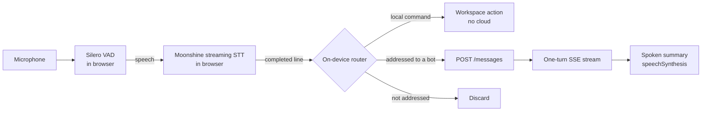

# Voice

Research note for Kanbus epic `chatticus-628234` (task `chatticus-9a4a1d`).
Researched 2026-10-04 against Moonshine Voice 0.1.5. Nothing here is built
yet.

## What we want

A human running a software factory from the web workspace can leave the
microphone on for as long as they like and direct their teammates by voice.
The design goal is **functional, cheap, intelligent voice control**. The bots
do not pretend to be people on a phone call.

The cost model follows from
[Design challenges](DESIGN_CHALLENGES.md) requirement 7, "nothing bills while
nobody is working":

- Listening, voice activity detection, transcription and simple commands run
  on the user's device, in the browser tab. They cost the cloud nothing.
- An utterance reaches the cloud only when it is addressed to a bot. It then
  becomes an ordinary `POST /channels/{id}/messages` and an ordinary one-turn
  stream ([Messaging](MESSAGING.md)). Voice adds no new transport.
- There is no audio stream to the cloud, no realtime multimodal model, no
  WebSocket and no per-minute meter. An hour of silence costs zero, and an
  hour of chatter between humans in the room also costs zero.

Not included: a duplex realtime voice API, a human-like persona, cloning the
user's voice, or a server-side transcription service.

## Moonshine today

Moonshine changed shape in 2026. The old `moonshine-js` package and the v1
models have been replaced by **Moonshine Voice**: one C++ core on ONNX Runtime,
with bindings for Python, WASM/TypeScript, Swift, Android and C. The
`usefulsensors` GitHub and Hugging Face names now redirect to `moonshine-ai`.

Sources:

- Repository: https://github.com/moonshine-ai/moonshine
- Paper (v2 streaming encoder): https://arxiv.org/abs/2602.12241

### Components

| Component | What it is | Licence | Relevance |
|---|---|---|---|
| Streaming STT, English | Tiny 34M / Small 123M / Medium 245M params. WER 12.0 / 7.8 / 6.7% | MIT | Core. Tiny or Small in the browser |
| Streaming STT, other languages | de, es, ja, zh, ar, tl, vi | MIT | Later |
| VAD | Silero, compiled into the `.wasm` | MIT (Silero) | Core: segments speech into lines |
| `AgentFlow` intent matching | Trigger phrases matched by cosine similarity over `embeddinggemma-300m` (about 200 MB at q4). Can fall back to substring matching | Moonshine MIT; **Gemma Terms of Use** on the embedding model | Useful pattern. Avoid the embedding model for now (see below) |
| Spelled-input recognizer | NATO alphabet and letter-by-letter input, 1.6 MB | MIT | Spelling branch names and ids |
| TTS | Kokoro-82M (about 110 MB), Piper voices, ZipVoice (cloning) | Apache-2.0 / per voice | Optional. Speech synthesis built into the browser is enough to start |
| Diarization | pyannote community-1, 8 MB | CC-BY-4.0 | Not needed for one user |
| Wake word | No packaged engine. Moonshine Micro has a trainable closed-vocabulary word classifier | MIT | See addressing below |
| Hosted API | **None**. Everything is on-device, and the CDN only serves model files | -- | Good: nothing to meter |

### In the browser

**Package:** `@moonshine-ai/moonshine-wasm` 0.1.5 (MIT, 2026-08-24).

```ts
const mic = new MicTranscriber()
  .onText((partial) => ...)
  .onLine((completedLine) => ...);
await mic.load();
await mic.start();
mic.setKeyterms(["Kanbus", "Chatticus", "develop"]);
```

**Runtime**

- It is the C++ core compiled to WASM with SIMD and threads, and runs on the
  CPU only. There is no WebGPU path.
- Speech-to-text and text-to-speech each run in their own Web Worker.
- Microphone capture uses an AudioWorklet.

**Required headers:** the published build needs `SharedArrayBuffer`, so the
page must send:

- `Cross-Origin-Opener-Policy: same-origin`
- `Cross-Origin-Embedder-Policy: require-corp`

A single-threaded build exists only if you build it from source.

**Model files**

- By default they come from `download.moonshine.ai`, which allows CORS and
  caches for 30 days. They are stored in the browser's Cache Storage.
- `Transcriber.loadFromUrls` lets us host the models ourselves.

**Quantized English streaming download sizes**

| Model | Download |
|---|---|
| Tiny | about 45 MB |
| Small | about 142 MB |
| Medium | about 269 MB |

The `.wasm` file adds 13 MB.

**Latency:** from the end of speech to the final line, native on a MacBook Pro.
Tiny 18 ms, Small 38 ms, Medium 59 ms. Whisper Tiny takes 277 ms on the same
machine. **No browser or WASM numbers are published.**

**Endpointing:** a line completes when VAD hears a pause (0.5 s averaging
window), with a forced cut at 15 s. There is no semantic model for
end-of-turn.

### Maturity

- 11k stars.
- Roughly weekly releases through July and August 2026.
- Pre-1.0, and the API was recently renamed: `DialogFlow` became `AgentFlow`.
- Open bug #229: concurrent streams share one VAD and corrupt it. We run one
  stream, so this does not affect us.
- **Safari and iOS are not tested or documented anywhere.**

Pin an exact version and expect churn.

## Design



### 1. Listening is local and free

`MicTranscriber` runs for as long as the user leaves listening on.

- Every completed line is transcribed on the device.
- Lines that are not addressed and are not commands are discarded. They never
  leave the tab.
- This is the privacy story as well as the cost story: the room's
  conversation is not uploaded.

**Model choice:** English Tiny Streaming is the default (45 MB). Small is an
opt-in for accuracy (142 MB). Medium is too large to download in a tab.

`setKeyterms` is fed from the roster, the channel names and the repository
vocabulary, so teammate names and project terms come out right.

### 2. A teammate's name is the wake word

Moonshine has no packaged wake-word engine, but there are several ways to
get one. Licensing problems sit with particular pretrained models, not with
the frameworks:

| Option | Licence | Notes |
|---|---|---|
| Text match on Moonshine STT output | MIT | No extra model. STT runs only on speech the VAD has found. Recommended default |
| Moonshine Micro command classifier (`WordCNN`) | MIT, including training (`micro/stt-training`) | About 1M params, custom vocabulary, built for microcontrollers. Running it in the browser is unverified |
| openWakeWord, trained by us | Code Apache-2.0 | Only the *pretrained* models are CC BY-NC-SA. A model we train ourselves is ours, subject to the licences of the training data (unverified). No official browser port |
| microWakeWord (ESPHome) | Unverified | Small streaming models. Licence and browser port unverified |
| Picovoice Porcupine | Paid enterprise only since 2026-06-30 | Price unverified |

A separate keyword spotter pays off only if continuous STT is too heavy on
CPU or battery. It would gate STT so that ordinary conversation in the room
is not decoded. Feasibility test 1 decides this. Until then we match on
text.

**Addressing is by teammate name** at the start of a line: "Ada, open a PR
for the voice spike". This fits the product: Chatticus already has named,
persistent teammates, and only the addressed bot acts.

Two follow-up forms:

- "Ada, ... over." keeps the floor open for multi-sentence instructions.
- A short follow-up window after a bot replies accepts unaddressed speech as
  continuing the same conversation.

### 3. The on-device command grammar

Many software-factory interactions need no model at all. A small,
deterministic grammar matched on the transcript handles them in the browser:

| Say | Effect | Cloud? |
|---|---|---|
| "Ada" / "switch to Ada" | Select the teammate (`handleSelectBot`) | No |
| "stop" / "cancel" | Close the current turn stream, stop speaking | No (or one POST if we add turn cancel) |
| "repeat that" / "read it" | Re-speak the last reply | No |
| "status" / "what's running" | Read out turn status and the task list (`listTasks`) | One cheap GET, no model |
| "approve, blue seven" / "deny" | `POST /approvals/{id}` with the on-screen code | One POST, no model |
| "send" / "scratch that" | Send or clear a dictated draft | No |
| "stop listening" | Turn the microphone off | No |

**Matcher:** use our own matcher (exact phrase plus a fuzzy edit-distance
threshold) rather than AgentFlow's embedding model.

- The embedding model is about 200 MB, which is too much for a tab.
- Its Gemma Terms of Use need a licence review before we ship it from our
  own CDN.
- A closed grammar is more predictable for control anyway.

We can still borrow `AgentFlow`'s dialog shape (`confirm`, `choose`,
global "cancel") or use `AgentFlow` with `use_embeddings(false)`.

**Approvals by voice are in scope.** The design must keep the rules in
[Approval](APPROVAL.md) intact:

- The human approves a **concrete operation**, not a model-authored summary.
- An approval authorizes only that immutable operation.
- Presence is guaranteed only by interactive review in the web tab.

Audio adds threats a click does not have:

- someone else in the room;
- a video or call playing through the speakers;
- the bot's own TTS output;
- a prompt-injected bot telling the human what to say.

So a voice approval works like this:

1. **The operation is on screen.** The approval card shows the exact
   operation (destination and payload). Any spoken read-back of it is
   rendered deterministically on the client from the approval payload.
   Model text never drives the read-back.
2. **The confirmation carries a short code shown only on screen.** The card
   shows a fresh code of two or three words or digits. TTS never speaks it,
   and the turn stream never carries it, so a bot cannot relay it.
   "Approve, blue seven" proves that someone is looking at this card.
3. **The confirmation is bound to the approval id.** The confirmation posts
   the existing `POST /approvals/{id}` with the code and
   `input_modality: "voice"` for the audit record. The server checks that the
   code matches the one it issued. A spoken "approve" without the code does
   nothing.
4. **The tab must be visible.** The microphone is muted while TTS speaks
   (half duplex), and approvals are refused while the tab is hidden.

The web app has no approval UI yet, so voice approvals depend on that work.
The challenge code adds a server-side field to approvals, so it starts as
Gherkin in `features/` like any other behavior.

### 4. Speaking back is functional

Bots answer in text in the channel, as they do today. Voice output reads a
**short spoken summary**: the first sentence, or "Ada finished; 3 files
changed". It does not read the whole message.

- **Start with `speechSynthesis`:** the Web Speech API built into the browser.
  It needs no download and costs nothing.
- **Upgrade if needed:** Moonshine's Kokoro voice (about 110 MB, Apache-2.0)
  is an opt-in for a consistent voice across browsers.
- **Half duplex:** STT ignores input while TTS speaks, and barge-in is off.
  Moonshine itself defaults barge-in off because of echo. "Stop" still works
  between sentences.

### 5. Server side changes

Almost none. A voice message is a human message. Two small additions:

- **Idempotency:** send an `Idempotency-Key` on voice posts. The API accepts
  it, but `web/lib/api.ts` does not send it today.
- **Origin tag:** an optional `input_modality: "voice"` on the message, so a
  bot can allow for transcription errors and write a speakable first sentence.

That tag is the only cross-cutting change. It needs a Gherkin scenario before
it lands.

### 6. Hosting changes

**Headers:** add COOP `same-origin` and COEP `require-corp` through a
CloudFront `ResponseHeadersPolicy` in `infra/lib/web-stack.ts`. Today the
stack sets neither header, and no CSP.

**Risks the headers carry**

- COOP `same-origin` breaks any popup-based sign-in. A redirect flow is
  unaffected. Verify the Google and Cognito sign-in.
- COEP `require-corp` blocks any cross-origin image, font or script that
  lacks CORP/CORS headers.
- The cross-origin-isolation headers can be scoped to `/chat` if needed.

**Model files:** host them ourselves, versioned, in the web bucket.

- MIT allows it.
- It pins the model to the package version.
- It makes them same-origin, so COEP is a non-issue.

`.ort` and `.wasm` need correct content types in the BucketDeployment.

## Cost

| Activity | Cloud cost |
|---|---|
| Microphone on, silence or unaddressed talk | $0 |
| Local command ("switch to Ada", "repeat", "stop") | $0 |
| Status or approval command | One Lambda invocation, no model |
| Addressed instruction | One ordinary turn, the same as typing it |
| One-time model download | About 58 MB of CloudFront egress per user per model version |

**Client side:** the cost is CPU and battery. Natively, Tiny Streaming uses
about 8% of one Apple M3 core. WASM will be slower by an amount nobody has
published. That is the main thing the spike has to measure.

## Feasibility tests

These gate the build. Spike code is throwaway, as in
[Feasibility tests](FEASIBILITY_TESTS.md).

1. **Browser cost of always-on listening.**
   - Run `MicTranscriber` with Tiny Streaming for 60 minutes in Chrome and
     Safari on a laptop, with the tab in the foreground and in the
     background.
   - Measure CPU, memory, battery drain, end-of-speech-to-line latency, and
     whether background-tab throttling stops the AudioWorklet.
   - If it fails: put a keyword spotter in front of STT (see section 2), or
     fall back to push-to-talk, or listen only while the tab is focused.
2. **Safari and iOS.**
   - Does the threaded WASM build load under COOP/COEP on iOS Safari within
     the tab memory limit?
   - If it fails: on iOS offer push-to-talk with the single-threaded build,
     or no voice.
3. **Cross-origin isolation against sign-in.**
   - Turn on COOP/COEP in development and run the full Google and Cognito
     sign-in plus the Vultus avatar.
   - If it fails: scope the headers to `/chat`, or adjust the sign-in flow.
4. **Accuracy on our vocabulary.**
   - Record about 50 typical commands and instructions, including teammate
     names, branch names and Kanbus ids.
   - Measure command-match rate and false addressing with and without
     `setKeyterms`.
   - If it fails: move to Small Streaming, or use spelled-input for ids.

## Build order

Each step is a Kanbus story with Gherkin first.

1. **Spike:** the feasibility tests above.
2. **Push-to-talk dictation:** a mic button next to Send fills the composer.
   Nothing is sent automatically.
3. **Continuous listening with addressing:** sends when a line is addressed
   to a named teammate, with a visible transcript and a listening indicator.
4. **Local command grammar:** select, stop, repeat, send, scratch, stop
   listening.
5. **Spoken summaries** through `speechSynthesis`.
6. **Voice approvals and status:** after the web approval UI exists.
7. **Optional:** Kokoro voice, Small model, non-English models.

## Open questions

- Is the on-screen challenge code enough for every consequential class, or
  do `purchase` and `production_change` also need a click?
- Should unaddressed lines ever be kept, for example as a local-only dictation
  scratchpad? The default is to discard them.
- Should the follow-up window be on by default? It is convenient, but it is
  also the main source of accidental sends.
- Does Moonshine redistributing EmbeddingGemma under Gemma terms matter to us?
  Only if we adopt `AgentFlow` embeddings.
