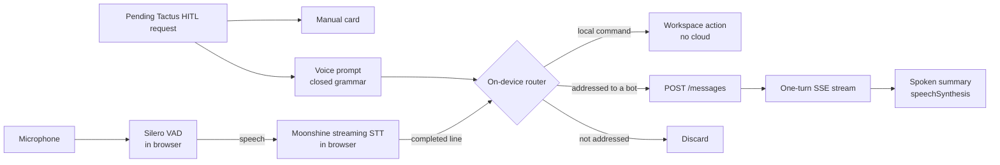

# Voice

Research note for Kanbus epic `chatticus-628234` (task `chatticus-9a4a1d`).
Researched 2026-10-04 against Moonshine Voice 0.1.5. Nothing here is built
yet.

## What we want

A human running a software factory from the web workspace can leave the
microphone on for as long as they like and direct their teammates by voice.
The design goal is **functional, cheap, intelligent voice control**. The bots
do not pretend to be people on a phone call.

The cost model follows from
[Design challenges](DESIGN_CHALLENGES.md) requirement 7, "nothing bills while
nobody is working":

- Listening, voice activity detection, transcription and simple commands run
  on the user's device, in the browser tab. They cost the cloud nothing.
- An utterance reaches the cloud only when it is addressed to a bot. It then
  becomes an ordinary `POST /channels/{id}/messages` and an ordinary one-turn
  stream ([Messaging](MESSAGING.md)). Voice adds no new transport.
- There is no audio stream to the cloud, no realtime multimodal model, no
  WebSocket and no per-minute meter. An hour of silence costs zero, and an
  hour of chatter between humans in the room also costs zero.

Not included: a duplex realtime voice API, a human-like persona, cloning the
user's voice, or a server-side transcription service.

## Moonshine today

Moonshine changed shape in 2026. The old `moonshine-js` package and the v1
models have been replaced by **Moonshine Voice**: one C++ core on ONNX Runtime,
with bindings for Python, WASM/TypeScript, Swift, Android and C. The
`usefulsensors` GitHub and Hugging Face names now redirect to `moonshine-ai`.

Sources:

- Repository: https://github.com/moonshine-ai/moonshine
- Paper (v2 streaming encoder): https://arxiv.org/abs/2602.12241

### Components

| Component | What it is | Licence | Relevance |
|---|---|---|---|
| Streaming STT, English | Tiny 34M / Small 123M / Medium 245M params. WER 12.0 / 7.8 / 6.7% | MIT | Core. Tiny or Small in the browser |
| Streaming STT, other languages | de, es, ja, zh, ar, tl, vi | MIT | Later |
| VAD | Silero, compiled into the `.wasm` | MIT (Silero) | Core: segments speech into lines |
| `AgentFlow` intent matching | Trigger phrases matched by cosine similarity over `embeddinggemma-300m` (about 200 MB at q4). Can fall back to substring matching | Moonshine MIT; **Gemma Terms of Use** on the embedding model | Useful pattern. Avoid the embedding model for now (see below) |
| Spelled-input recognizer | NATO alphabet and letter-by-letter input, 1.6 MB | MIT | Spelling branch names and ids |
| TTS | Kokoro-82M (about 110 MB), Piper voices, ZipVoice (cloning) | Apache-2.0 / per voice | Optional. Speech synthesis built into the browser is enough to start |
| Diarization | pyannote community-1, 8 MB | CC-BY-4.0 | Not needed for one user |
| Wake word | No packaged engine. Moonshine Micro has a trainable closed-vocabulary word classifier | MIT | See addressing below |
| Hosted API | **None**. Everything is on-device, and the CDN only serves model files | -- | Good: nothing to meter |

### In the browser

**Package:** `@moonshine-ai/moonshine-wasm` 0.1.5 (MIT, 2026-08-24).

```ts
const mic = new MicTranscriber()
  .onText((partial) => ...)
  .onLine((completedLine) => ...);
await mic.load();
await mic.start();
mic.setKeyterms(["Kanbus", "Chatticus", "develop"]);
```

**Runtime**

- It is the C++ core compiled to WASM with SIMD and threads, and runs on the
  CPU only. There is no WebGPU path.
- Speech-to-text and text-to-speech each run in their own Web Worker.
- Microphone capture uses an AudioWorklet.

**Required headers:** the published build needs `SharedArrayBuffer`, so the
page must send:

- `Cross-Origin-Opener-Policy: same-origin`
- `Cross-Origin-Embedder-Policy: require-corp`

A single-threaded build exists only if you build it from source.

**Model files**

- By default they come from `download.moonshine.ai`, which allows CORS and
  caches for 30 days. They are stored in the browser's Cache Storage.
- `Transcriber.loadFromUrls` lets us host the models ourselves.

**Quantized English streaming download sizes**

| Model | Download |
|---|---|
| Tiny | about 45 MB |
| Small | about 142 MB |
| Medium | about 269 MB |

The `.wasm` file adds 13 MB.

**Latency:** from the end of speech to the final line, native on a MacBook Pro.
Tiny 18 ms, Small 38 ms, Medium 59 ms. Whisper Tiny takes 277 ms on the same
machine. **No browser or WASM numbers are published.**

**Endpointing:** a line completes when VAD hears a pause (0.5 s averaging
window), with a forced cut at 15 s. There is no semantic model for
end-of-turn.

### Maturity

- 11k stars.
- Roughly weekly releases through July and August 2026.
- Pre-1.0, and the API was recently renamed: `DialogFlow` became `AgentFlow`.
- Open bug #229: concurrent streams share one VAD and corrupt it. We run one
  stream, so this does not affect us.
- **Safari and iOS are not tested or documented anywhere.**

Pin an exact version and expect churn.

## Design



### 1. Listening is local and free

`MicTranscriber` runs for as long as the user leaves listening on.

- Every completed line is transcribed on the device.
- Lines that are not addressed and are not commands are discarded. They never
  leave the tab.
- The two follow-up forms in section 2 are the exception: they send speech
  that does not start with a name. The listening indicator shows when the
  floor is open, so the user can see when unaddressed speech will be sent.
- This is the privacy story as well as the cost story: the room's
  conversation is not uploaded.

**Model choice:** English Tiny Streaming is the default (45 MB). Small is an
opt-in for accuracy (142 MB). Medium is too large to download in a tab.

`setKeyterms` is fed from the roster, the channel names and the repository
vocabulary, so teammate names and project terms come out right.

### 2. A teammate's name is the wake word

Moonshine has no packaged wake-word engine, but there are several ways to
get one. Licensing problems sit with particular pretrained models, not with
the frameworks:

| Option | Licence | Notes |
|---|---|---|
| Text match on Moonshine STT output | MIT | No extra model. STT runs only on speech the VAD has found. Recommended default |
| Moonshine Micro command classifier (`WordCNN`) | MIT, including training (`micro/stt-training`) | About 1M params, custom vocabulary, built for microcontrollers. Running it in the browser is unverified |
| openWakeWord, trained by us | Code Apache-2.0 | Only the *pretrained* models are CC BY-NC-SA. A model we train ourselves is ours, subject to the licences of the training data (unverified). No official browser port |
| microWakeWord (ESPHome) | Unverified | Small streaming models. Licence and browser port unverified |
| Picovoice Porcupine | Paid enterprise only since 2026-06-30 | Price unverified |

A separate keyword spotter pays off only if continuous STT is too heavy on
CPU or battery. It would gate STT so that ordinary conversation in the room
is not decoded. Feasibility test 1 decides this. Until then we match on
text.

**Addressing is by teammate name** at the start of a line: "Ada, open a PR
for the voice spike". This fits the product: Chatticus already has named,
persistent teammates, and only the addressed bot acts.

Two follow-up forms:

- "Ada, ... over." keeps the floor open for multi-sentence instructions.
- A short follow-up window after a bot replies accepts unaddressed speech as
  continuing the same conversation.

### 3. The on-device command grammar

Many software-factory interactions need no model at all. A small,
deterministic grammar matched on the transcript handles them in the browser:

| Say | Effect | Cloud? |
|---|---|---|
| "Ada" / "switch to Ada" | Select the teammate (`selectItem` in `web/components/EnabledWorkspace.tsx`) | No |
| "quiet" / "skip" | Stop speaking the current reply. The turn keeps running | No |
| "stop" / "cancel the turn" | Cancel the running turn. Closing the stream alone does not stop the worker, so this needs a turn-cancel POST, which does not exist yet | One POST |
| "repeat that" / "read it" | Re-speak the last reply | No |
| "status" / "what's running" | Read out turn status and the task list (`listTasks`) | One cheap GET, no model |
| Answering a pending HITL request ("approve, blue seven", "deny", "option two") | Response to that request (section 3a) | One POST, no model |
| "send" / "scratch that" | Send or clear a dictated draft | No |
| "stop listening" | Turn the microphone off | No |

**Matcher:** use our own matcher (exact phrase plus a fuzzy edit-distance
threshold) rather than AgentFlow's embedding model.

- The embedding model is about 200 MB, which is too much for a tab.
- Its Gemma Terms of Use need a licence review before we ship it from our
  own CDN.
- A closed grammar is more predictable for control anyway.
- The matcher reads the whole completed line and prefers the longest match,
  so "stop listening" never triggers "stop" (turn cancel).

We can still borrow `AgentFlow`'s dialog shape (`confirm`, `choose`,
global "cancel") or use `AgentFlow` with `use_embeddings(false)`.

### 3a. Human in the loop: one request, two surfaces

Agents ask humans questions through Tactus human-in-the-loop (HITL)
primitives. Voice does not get its own approval system. It is one more Tactus
HITL **channel**, presented in the web tab alongside the manual UI, and both
render the same request.

**What Tactus already provides.** References are to
the Tactus repository (`tactus/` package) at the time of writing.

| Area | What exists |
|---|---|
| Primitives (`primitives/human.py`) | `approve`, `input`, `select`, `review`, `escalate`, `upload`, `multiple`, `custom`, `notify` |
| Request data (`protocols/control.py`, `ControlRequest`) | `request_type`, `message`, `options[{label, value, style, description}]`, `default_value`, `timeout_seconds` |
| Action contract | `action_key`, `resource_refs`, `preconditions`, `expires_at`, `response_schema` (JSON Schema), `ui_schema` |
| Response data (`ControlResponse`) | `value`, `channel_id`, `responder_id` |
| Delivery (`adapters/control_loop.py`) | Sends to every capable channel. **The first response wins**, and the other channels get `cancel`. Waits are durable checkpoints, and request ids are deterministic, so replay is idempotent |

There is no voice channel in Tactus yet. Chatticus does not reference Tactus
on `develop` yet either; that integration is in progress.

**The voice presenter.** It is a web-tab presenter for the same pending
request the manual card shows.

1. **Prompt.** The request is rendered from the structured fields
   (`request_type`, `options`, `ui_schema`, `resource_refs`) into a short,
   deterministic spoken prompt: "Ada asks: approve sending the release
   notes to the team list? Say approve or deny." The free-text `message` is
   shown on the card. It is spoken only for non-consequential request types.
2. **Grammar per request.** Each request type gets a closed grammar built
   from its schema:
   - `approve`: approve or deny.
   - `select`: the option labels, or "option two".
   - `input`: dictated free text, read back, then "send".
   - `review`: approve or reject, plus a spoken comment.
   - `upload`, `multiple` and rich `custom` components: the presenter
     declares no voice support, so they stay on the card.
3. **Answer.** The utterance is mapped to a value and validated against
   `response_schema` in the browser. It is then posted through the same
   endpoint the card uses, with `channel_id="voice"` and the signed-in human
   as `responder_id`. There is one answer path, not two. When Tactus HITL is
   wired into turns, `POST /approvals/{id}` ([Messaging](MESSAGING.md))
   becomes the host-side delivery of a Tactus `ControlResponse` for any
   request type, rather than a parallel approval system.
4. **Race.** The manual card and the voice prompt are two presenters of one
   request. Whichever answers first wins. The other is cancelled: the card
   closes, or the voice prompt stops speaking and drops its grammar.

**Consequential approvals keep the [Approval](APPROVAL.md) rules.** When a
request carries an action contract for a consequential class (`send`,
`publish`, `purchase`, `delete`, `production_change`), these hold:

- **What is spoken.** The spoken and displayed operation comes from
  `resource_refs` and Chatticus's own `StructuredConsequentialOperation`
  (destination and payload), never from the model-authored `message`.
- **The code.** The card shows a confirmation code bound to `request_id`,
  for example "blue seven".
  - **How it reaches the card:** a human-session-only read that the bot's
    credentials cannot reach. It is never on the turn stream, in a channel
    row, in the transcript, or in TTS output, so a bot cannot relay it.
  - **Rules:** single-use, it expires with the request (`expires_at`), and
    three wrong attempts void the request so it must be re-issued.
- **The check does not depend on the channel.** The server requires the
  matching code on **every** response to a consequential request, whether it
  came from a click or from speech. The card submits the code it displays
  along with the click. Voice requires the human to say it. Because the
  check never reads `channel_id`, a response cannot skip it by claiming to
  come from the card.
- **What the server proves, and what only the client enforces.** The server
  proves that the response came from a human session that could read the
  code. That the human *looked at the card and said the code* is enforced
  only by the client's voice grammar.
- **Freshness.** The server re-checks `preconditions` and `expires_at`
  itself, because Tactus passes them through without enforcing them.

**What the code proves, and what it does not.**

- **It proves** that whoever spoke can see this card right now. That defeats
  the bot's own TTS, a prompt-injected bot coaching the human, and audio from
  a video.
- **It does not prove** that the signed-in user is the speaker. Someone else
  in the room, or a screen-share on a call, can read the code aloud. Voice
  approval assumes the signed-in user controls the room the microphone hears.
  If that is not acceptable for a class, that class requires a click (open
  question below).
- **Client-side checks:** half duplex (the microphone is muted while TTS
  speaks) and "no voice answers while the tab is hidden". These are hygiene,
  not security controls.
- **`channel_id="voice"`** is audit metadata claimed by the client. It is
  never a policy input.

**Upstream work in Tactus.**

- The control loop's capability filter checks only approval, input, review
  and escalation. A voice channel needs to be able to opt out of `select`,
  `input` and `upload` by capability.
- The SSE channel leaves `responder_id` empty. It should be set.

**Depends on.** The web app has no HITL or approval UI yet, and Chatticus has
not yet wired Tactus HITL into turns. Voice answers come after the manual
card, through the same request. The confirmation code is new server
behavior, so it starts as Gherkin in `features/`.

### 4. Speaking back is functional

Bots answer in text in the channel, as they do today. Voice output reads a
**short spoken summary**: the first sentence, or "Ada finished; 3 files
changed". It does not read the whole message.

- **Start with `speechSynthesis`:** the Web Speech API built into the browser.
  It needs no download and costs nothing.
- **Upgrade if needed:** Moonshine's Kokoro voice (about 110 MB, Apache-2.0)
  is an opt-in for a consistent voice across browsers.
- **Half duplex:** STT ignores input while TTS speaks, and barge-in is off.
  Moonshine itself defaults barge-in off because of echo. "Quiet" still works
  between sentences.

### 5. Server side changes

A voice message is a human message, so the turn path does not change. Each
of these is new server behavior and starts as Gherkin:

- **Idempotency:** `postMessage` in `web/lib/api.ts` does not send an
  `Idempotency-Key`, although `createBot` and `createChannel` do. Voice posts
  need one, because a retried line must not become two turns.
- **Origin tag:** an optional `input_modality: "voice"` on the message, so a
  bot can allow for transcription errors and write a speakable first sentence.
  It is metadata and never a policy input.
- **Turn cancel:** a POST that cancels a running turn, so "stop" actually stops
  the worker.
- **Confirmation code:** issuing, reading and checking the code on
  consequential HITL requests (section 3a).

### 6. Hosting changes

**Headers:** add COOP `same-origin` and COEP `require-corp` through a
CloudFront `ResponseHeadersPolicy` in `infra/lib/web-stack.ts`. Today the
stack sets neither header, and no CSP.

**Risks the headers carry**

- COOP `same-origin` breaks any popup-based sign-in. A redirect flow is
  unaffected. Verify the Google and Cognito sign-in.
- COEP `require-corp` blocks any cross-origin image, font or script that
  lacks CORP/CORS headers. COEP `credentialless` relaxes this for no-cors
  subresources. Whether Moonshine's threaded build and Safari accept it is
  part of feasibility test 3.
- The cross-origin-isolation headers can be scoped to `/chat` if needed.

**Model files:** host them ourselves, versioned, in the web bucket.

- MIT allows it.
- It pins the model to the package version.
- It makes them same-origin, so COEP is a non-issue.

`.ort` and `.wasm` need correct content types in the BucketDeployment.

## Cost

| Activity | Cloud cost |
|---|---|
| Microphone on, silence or unaddressed talk | $0 |
| Local command ("switch to Ada", "repeat", "quiet") | $0 |
| "Stop" (turn cancel) | One POST, no model. Saves the rest of the turn |
| Status command, or an answer to a HITL request | One Lambda invocation, no model |
| Addressed instruction | One ordinary turn, the same as typing it |
| One-time model download | About 58 MB of CloudFront egress per user per model version (Tiny plus WASM). About 155 MB with the Small opt-in |

**Client side:** the cost is CPU and battery. Natively, Tiny Streaming uses
about 8% of one Apple M3 core. WASM will be slower by an amount nobody has
published. That is the main thing the spike has to measure.

## Feasibility tests

These gate the build. Spike code is throwaway, as in
[Feasibility tests](FEASIBILITY_TESTS.md).

1. **Browser cost of always-on listening.**
   - Run `MicTranscriber` with Tiny Streaming for 60 minutes in Chrome and
     Safari on a laptop, with the tab in the foreground and in the
     background.
   - Measure CPU, memory, battery drain, end-of-speech-to-line latency, and
     whether background-tab throttling stops the AudioWorklet.
   - If it fails: put a keyword spotter in front of STT (see section 2), or
     fall back to push-to-talk, or listen only while the tab is focused.
2. **Safari and iOS.**
   - Does the threaded WASM build load under COOP/COEP on iOS Safari within
     the tab memory limit?
   - If it fails: on iOS offer push-to-talk with the single-threaded build,
     or no voice.
3. **Cross-origin isolation against sign-in.**
   - Turn on COOP/COEP in development and run the full Google and Cognito
     sign-in plus the Vultus avatar.
   - If it fails: scope the headers to `/chat`, or adjust the sign-in flow.
4. **Accuracy on our vocabulary.**
   - Record about 50 typical commands and instructions, including teammate
     names, branch names and Kanbus ids.
   - Measure command-match rate and false addressing with and without
     `setKeyterms`.
   - If it fails: move to Small Streaming, or use spelled-input for ids.

## Build order

Each step is a Kanbus story with Gherkin first.

1. **Spike:** the feasibility tests above.
2. **Push-to-talk dictation:** a mic button next to Send fills the composer.
   Nothing is sent automatically.
3. **Continuous listening with addressing:** sends when a line is addressed
   to a named teammate, with a visible transcript and a listening indicator.
4. **Local command grammar:** select, quiet, repeat, send, scratch, stop
   listening. "Stop" (turn cancel) follows once the turn-cancel POST exists.
5. **Spoken summaries** through `speechSynthesis`.
6. **A voice presenter for Tactus HITL requests:** after the manual HITL
   card exists in the web app. Includes the confirmation code for
   consequential approvals.
7. **Optional:** Kokoro voice, Small model, non-English models.

## Open questions

- Is the on-screen challenge code enough for every consequential class, or
  do `purchase` and `production_change` also need a click?
- Should unaddressed lines ever be kept, for example as a local-only dictation
  scratchpad? The default is to discard them.
- Should the follow-up window be on by default? It is convenient, but it is
  also the main source of accidental sends.
- Does Moonshine redistributing EmbeddingGemma under Gemma terms matter to us?
  Only if we adopt `AgentFlow` embeddings.
