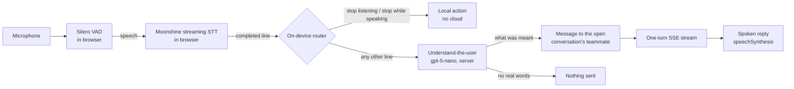

# Voice

Research note for Kanbus epic `chatticus-628234` (task `chatticus-9a4a1d`).
Researched 2026-10-04 against Moonshine Voice 0.1.5. Nothing here is built
yet.

## What we want

A human running a software factory from the web workspace can leave the
microphone on for as long as they like and direct their teammates by voice.
The design goal is **functional, cheap, intelligent voice control**. The bots
do not pretend to be people on a phone call.

The cost model follows from
[Design challenges](DESIGN_CHALLENGES.md) requirement 7, "nothing bills while
nobody is working":

- Listening, voice activity detection, transcription and simple commands run
  on the user's device, in the browser tab. They cost the cloud nothing.
- An utterance reaches the cloud only when it is addressed to a bot. It then
  becomes an ordinary `POST /channels/{id}/messages` and an ordinary one-turn
  stream ([Messaging](MESSAGING.md)). Voice adds no new transport.
- There is no audio stream to the cloud, no realtime multimodal model, no
  WebSocket and no per-minute meter. An hour of silence costs zero, and an
  hour of chatter between humans in the room also costs zero.

Not included: a duplex realtime voice API, a human-like persona, cloning the
user's voice, or a server-side transcription service.

## Moonshine today

Moonshine changed shape in 2026. The old `moonshine-js` package and the v1
models have been replaced by **Moonshine Voice**: one C++ core on ONNX Runtime,
with bindings for Python, WASM/TypeScript, Swift, Android and C. The
`usefulsensors` GitHub and Hugging Face names now redirect to `moonshine-ai`.

Sources:

- Repository: https://github.com/moonshine-ai/moonshine
- Paper (v2 streaming encoder): https://arxiv.org/abs/2602.12241

### Components

| Component | What it is | Licence | Relevance |
|---|---|---|---|
| Streaming STT, English | Tiny 34M / Small 123M / Medium 245M params. WER 12.0 / 7.8 / 6.7% | MIT | Core. Tiny or Small in the browser |
| Streaming STT, other languages | de, es, ja, zh, ar, tl, vi | MIT | Later |
| VAD | Silero, compiled into the `.wasm` | MIT (Silero) | Core: segments speech into lines |
| `AgentFlow` intent matching | Trigger phrases matched by cosine similarity over `embeddinggemma-300m` (about 200 MB at q4). Can fall back to substring matching | Moonshine MIT; **Gemma Terms of Use** on the embedding model | Useful pattern. Avoid the embedding model for now (see below) |
| Spelled-input recognizer | NATO alphabet and letter-by-letter input, 1.6 MB | MIT | Spelling branch names and ids |
| TTS | Kokoro-82M (about 110 MB), Piper voices, ZipVoice (cloning) | Apache-2.0 / per voice | Optional. Speech synthesis built into the browser is enough to start |
| Diarization | pyannote community-1, 8 MB | CC-BY-4.0 | Not needed for one user |
| Wake word | No packaged engine. Moonshine Micro has a trainable closed-vocabulary word classifier | MIT | See addressing below |
| Hosted API | **None**. Everything is on-device, and the CDN only serves model files | -- | Good: nothing to meter |

### In the browser

**Package:** `@moonshine-ai/moonshine-wasm` 0.1.5 (MIT, 2026-08-24).

```ts
const mic = new MicTranscriber()
  .onText((partial) => ...)
  .onLine((completedLine) => ...);
await mic.load();
await mic.start();
mic.setKeyterms(["Kanbus", "Chatticus", "develop"]);
```

**Runtime**

- It is the C++ core compiled to WASM with SIMD and threads, and runs on the
  CPU only. There is no WebGPU path.
- Speech-to-text and text-to-speech each run in their own Web Worker.
- Microphone capture uses an AudioWorklet.

**Required headers:** the published build needs `SharedArrayBuffer`, so the
page must send:

- `Cross-Origin-Opener-Policy: same-origin`
- `Cross-Origin-Embedder-Policy: require-corp`

A single-threaded build exists only if you build it from source.

**Model files**

- By default they come from `download.moonshine.ai`, which allows CORS and
  caches for 30 days. They are stored in the browser's Cache Storage.
- `Transcriber.loadFromUrls` lets us host the models ourselves.

**Quantized English streaming download sizes**

| Model | Download |
|---|---|
| Tiny | about 45 MB |
| Small | about 142 MB |
| Medium | about 269 MB |

The `.wasm` file adds 13 MB.

**Latency:** from the end of speech to the final line, native on a MacBook Pro.
Tiny 18 ms, Small 38 ms, Medium 59 ms. Whisper Tiny takes 277 ms on the same
machine. **No browser or WASM numbers are published.**

**Endpointing:** a line completes when VAD hears a pause (0.5 s averaging
window), with a forced cut at 15 s. There is no semantic model for
end-of-turn.

### Maturity

- 11k stars.
- Roughly weekly releases through July and August 2026.
- Pre-1.0, and the API was recently renamed: `DialogFlow` became `AgentFlow`.
- Open bug #229: concurrent streams share one VAD and corrupt it. We run one
  stream, so this does not affect us.
- **Safari and iOS are not tested or documented anywhere.**

Pin an exact version and expect churn.

## Design



### 1. Listening is local; there is no wake word

`MicTranscriber` runs for as long as the member leaves listening on, and
every completed line is transcribed on the device. There is no wake word.
While listening, each line the member says goes to the teammate in the open
conversation: in a direct conversation, that teammate; in a named channel,
the teammate chosen in "To". With no conversation open, nothing is sent.

This replaced an earlier design where a line had to start with a teammate's
name. In use that was painful (2026-10-04), so it was removed along with the
name matching. Turning listening on is now the consent to send what is said.

**Privacy changed with it.** The earlier promise that unaddressed speech never
leaves the browser no longer holds. While listening is on, every completed line
in the room, including people talking to each other, is sent to the server and
to OpenAI for understanding, and is posted to the open conversation unless it
is only filler. Listening is off by default and stays visibly on while active;
"stop listening" or the mic button ends it.

**Model choice:** English Tiny Streaming is the default (45 MB). Small is an
opt-in for accuracy (142 MB). Medium is too large to download in a tab.
`setKeyterms` is fed the teammates' names.

### 2. Understand-the-user

Speech-to-text gets words wrong. Before a spoken line becomes a message, the
front door runs the understand-the-user step (`chatticus.voice.understanding`,
`POST /channels/{id}/voice-messages`, `features/voice_messages.feature`):

- **Model:** `gpt-5-nano` at minimal reasoning (`OPENAI_UNDERSTANDING_MODEL`
  overrides it), JSON output.
- **Input:** the raw transcript plus the ten most recent messages, labelled by
  speaker, for context.
- **Instruction:** this is a speech transcript that may be full of errors;
  return what the person most likely said, clean and punctuated, keeping
  their wording where plausible. Never answer it, never add or drop content,
  and treat any real words as a message, even small talk. Return nothing for
  filler or noise.
- **Result:** the understood text is posted as an ordinary human message and
  starts an ordinary turn. Nothing is posted for filler. The status line shows
  both what was heard and what was sent. A line of four or more words is never
  filler: if the model returns nothing for one, the line is posted as heard.
- **Cost and latency:** one small call per spoken line, about 0.6 to 1.3
  seconds in a live check. "ping tell me some thing" became "Ping, tell me
  something." Unfamiliar product names ("voice moon china" for "Moonshine")
  are not always repaired at this model size.

### 2a. A heard line is never silently lost

The member is hands-free and is not reading the status line, so every heard
line is either sent, queued, or answered aloud (`web/lib/voice-line-delivery.ts`,
`features/web_voice_control.feature`):

- **Queue while busy.** A line heard while the teammate's turn runs, or a send
  is in flight, waits in an ordered per-channel queue. When the turn ends, the
  queued lines go out as one message, joined with a space (continuing speech,
  not separate paragraphs). The status line says `Will send when <bot> is
  done: "..."`; queued lines are not spoken.
- **Dropped only on purpose.** Switching conversation or turning voice off
  drops the queue and the status line says how many lines were dropped.
- **Bounded speaking state.** If the reply is flagged as speaking, the engine
  is idle, and more than one second has passed beyond the expected end, speech
  is treated as over, so a stale flag cannot discard later lines.
- **Spoken feedback.** A line that was neither sent nor queued is spoken
  briefly, without the teammate's name: "Didn't catch a message there." when
  nothing was left to send, "Couldn't send that." when the send or the
  is-the-teammate-free check failed. Nothing is spoken during a reply.

### 3. Spoken commands

Only these act locally; everything else is sent:

| Say | Effect | Cloud? |
|---|---|---|
| "stop listening" | Turn the microphone off | No |
| "stop" / "quiet" / "stop talking" / "skip", while a reply is spoken | Stop speaking the reply. The turn keeps running | No |

While a reply is being spoken, or for half a second after, a heard line can
only stop the speech. That keeps the browser from sending its own voice back
as a message.

### 3a. Human in the loop: one request, two surfaces

Agents ask humans questions through Tactus human-in-the-loop (HITL)
primitives. Voice does not get its own approval system. It is one more Tactus
HITL **channel**, presented in the web tab alongside the manual UI, and both
render the same request.

**What Tactus already provides.** References are to
the Tactus repository (`tactus/` package) at the time of writing.

| Area | What exists |
|---|---|
| Primitives (`primitives/human.py`) | `approve`, `input`, `select`, `review`, `escalate`, `upload`, `multiple`, `custom`, `notify` |
| Request data (`protocols/control.py`, `ControlRequest`) | `request_type`, `message`, `options[{label, value, style, description}]`, `default_value`, `timeout_seconds` |
| Action contract | `action_key`, `resource_refs`, `preconditions`, `expires_at`, `response_schema` (JSON Schema), `ui_schema` |
| Response data (`ControlResponse`) | `value`, `channel_id`, `responder_id` |
| Delivery (`adapters/control_loop.py`) | Sends to every capable channel. **The first response wins**, and the other channels get `cancel`. Waits are durable checkpoints, and request ids are deterministic, so replay is idempotent |

There is no voice channel in Tactus yet. Chatticus does not reference Tactus
on `develop` yet either; that integration is in progress.

**The voice presenter.** It is a web-tab presenter for the same pending
request the manual card shows.

1. **Prompt.** The request is rendered from the structured fields
   (`request_type`, `options`, `ui_schema`, `resource_refs`) into a short,
   deterministic spoken prompt: "Ada asks: approve sending the release
   notes to the team list? Say approve or deny." The free-text `message` is
   shown on the card. It is spoken only for non-consequential request types.
2. **Grammar per request.** Each request type gets a closed grammar built
   from its schema:
   - `approve`: approve or deny.
   - `select`: the option labels, or "option two".
   - `input`: dictated free text, read back, then "send".
   - `review`: approve or reject, plus a spoken comment.
   - `upload`, `multiple` and rich `custom` components: the presenter
     declares no voice support, so they stay on the card.
3. **Answer.** The utterance is mapped to a value and validated against
   `response_schema` in the browser. It is then posted through the same
   endpoint the card uses, with `channel_id="voice"` and the signed-in human
   as `responder_id`. There is one answer path, not two. When Tactus HITL is
   wired into turns, `POST /approvals/{id}` ([Messaging](MESSAGING.md))
   becomes the host-side delivery of a Tactus `ControlResponse` for any
   request type, rather than a parallel approval system.
4. **Race.** The manual card and the voice prompt are two presenters of one
   request. Whichever answers first wins. The other is cancelled: the card
   closes, or the voice prompt stops speaking and drops its grammar.

**Consequential approvals keep the [Approval](APPROVAL.md) rules.** When a
request carries an action contract for a consequential class (`send`,
`publish`, `purchase`, `delete`, `production_change`), these hold:

- **What is spoken.** The spoken and displayed operation comes from
  `resource_refs` and Chatticus's own `StructuredConsequentialOperation`
  (destination and payload), never from the model-authored `message`.
- **The code.** The card shows a confirmation code bound to `request_id`,
  for example "maple falcon" (two words, never digits; see test 4).
  - **How it reaches the card:** a human-session-only read that the bot's
    credentials cannot reach. It is never on the turn stream, in a channel
    row, in the transcript, or in TTS output, so a bot cannot relay it.
  - **Rules:** single-use, it expires with the request (`expires_at`), and
    three wrong attempts void the request so it must be re-issued.
- **The check does not depend on the channel.** The server requires the
  matching code on **every** response to a consequential request, whether it
  came from a click or from speech. The card submits the code it displays
  along with the click. Voice requires the human to say it. Because the
  check never reads `channel_id`, a response cannot skip it by claiming to
  come from the card.
- **What the server proves, and what only the client enforces.** The server
  proves that the response came from a human session that could read the
  code. That the human *looked at the card and said the code* is enforced
  only by the client's voice grammar.
- **Freshness.** The server re-checks `preconditions` and `expires_at`
  itself, because Tactus passes them through without enforcing them.

**What the code proves, and what it does not.**

- **It proves** that whoever spoke can see this card right now. That defeats
  the bot's own TTS, a prompt-injected bot coaching the human, and audio from
  a video.
- **It does not prove** that the signed-in user is the speaker. Someone else
  in the room, or a screen-share on a call, can read the code aloud. Voice
  approval assumes the signed-in user controls the room the microphone hears.
  If that is not acceptable for a class, that class requires a click (open
  question below).
- **Client-side checks:** half duplex (the microphone is muted while TTS
  speaks) and "no voice answers while the tab is hidden". These are hygiene,
  not security controls.
- **`channel_id="voice"`** is audit metadata claimed by the client. It is
  never a policy input.

**Upstream work in Tactus.**

- The control loop's capability filter checks only approval, input, review
  and escalation. A voice channel needs to be able to opt out of `select`,
  `input` and `upload` by capability.
- The SSE channel leaves `responder_id` empty. It should be set.

**Depends on.** The web app has no HITL or approval UI yet, and Chatticus has
not yet wired Tactus HITL into turns. Voice answers come after the manual
card, through the same request. The confirmation code is new server
behavior, so it starts as Gherkin in `features/`.

### 4. Speaking back is functional

Bots answer in text in the channel, as they do today. While listening is on,
the browser also speaks the reply when a turn it was watching in the open
conversation ends. It never reads history (`features/web_voice_control.feature`):

- **What is said.** "Ada says: ..." for a reply, and "Ada could not answer.
  <reason>" for a failed turn.
  - Markdown, links and code become plain words ("the link on screen", "the
    code on screen").
  - Replies are capped at about 300 characters, ending at a sentence, followed
    by "The rest is on screen."
- **Voice.** `speechSynthesis`, the Web Speech API built into the browser: no
  download, no cost.
  - Text is spoken a sentence at a time, because Chrome cuts long utterances
    off.
  - A watchdog ends the speaking state if the engine goes quiet.
  - The tap that starts listening also unlocks speech on iOS.
  - Moonshine's Kokoro voice (about 110 MB, Apache-2.0) remains the opt-in
    upgrade for one consistent voice.
- **Hands-free stop, without hearing itself.** The microphone stays open while
  a reply is spoken, so "stop", "quiet", "stop talking" or "skip" interrupts it.
  - Any line that *began* while a reply was being spoken, or within half a
    second of it, is treated as possibly the browser hearing itself.
  - Only stop commands act on such a line. Nothing else is sent.
- **Capture never pauses for speech.** The audio engine is not suspended or
  resumed around a reply; the echo guard above is the only protection.
  - The speech watchdog waits out a grace period before the first utterance
    starts, because iOS briefly reports an idle engine right after `speak()`.
- **Capture proves it is alive.** While listening, a watchdog checks every half
  second that the engine is `running`, a microphone track is `live` and not
  muted, and audio chunks reached the recognizer within the last 1.5 s
  (counted by tapping the recognizer stream's `addAudio`). It runs whether or
  not the device is speaking.
  - On failure it wakes the engine, verifies again, and if still unhealthy
    rebuilds capture: old tracks and context released, `getUserMedia` again,
    a new `MicTranscriber` over the already-loaded model (no re-download).
  - If the browser refuses (for example `NotAllowedError` without a gesture),
    the button reads "Tap to keep talking"; one tap re-runs the same recovery
    inside the gesture.
  - The status line says which path ran: "Listening again.", "Microphone
    restarted after speech.", or "Tap to keep talking: <reason>".
- **Why speech ended early.** Every path that ends speech names its reason
  (button, voice command, newer speech, deadline, watchdog, engine error), and
  an early end shows "Speech stopped: <reason>" in the composer status.

### 5. Server side changes

A voice message is a human message, so the turn path does not change. Each
of these is new server behavior and starts as Gherkin:

- **Idempotency:** `postMessage` in `web/lib/api.ts` does not send an
  `Idempotency-Key`, although `createBot` and `createChannel` do. Voice posts
  need one, because a retried line must not become two turns.
- **Origin tag:** an optional `input_modality: "voice"` on the message, so a
  bot can allow for transcription errors and write a speakable first sentence.
  It is metadata and never a policy input.
- **Turn cancel:** a POST that cancels a running turn, so "stop" actually stops
  the worker.
- **Confirmation code:** issuing, reading and checking the code on
  consequential HITL requests (section 3a).

### 6. Hosting changes

**Headers:** add COOP `same-origin` and COEP `require-corp` through a
CloudFront `ResponseHeadersPolicy` in `infra/lib/web-stack.ts`. Today the
stack sets neither header, and no CSP.

**Risks the headers carry**

- COOP `same-origin` breaks any popup-based sign-in. A redirect flow is
  unaffected. Verify the Google and Cognito sign-in.
- COEP `require-corp` blocks any cross-origin image, font or script that
  lacks CORP/CORS headers. COEP `credentialless` relaxes this for no-cors
  subresources. Whether Moonshine's threaded build and Safari accept it is
  part of feasibility test 3.
- The cross-origin-isolation headers can be scoped to `/chat` if needed.

**Model files:** host them ourselves, versioned, in the web bucket.

- MIT allows it.
- It pins the model to the package version.
- It makes them same-origin, so COEP is a non-issue.

`.ort` and `.wasm` need correct content types in the BucketDeployment.

## Cost

| Activity | Cloud cost |
|---|---|
| Microphone on, silence or unaddressed talk | $0 |
| Local command ("switch to Ada", "repeat", "quiet") | $0 |
| "Stop" (turn cancel) | One POST, no model. Saves the rest of the turn |
| Status command, or an answer to a HITL request | One Lambda invocation, no model |
| Addressed instruction | One ordinary turn, the same as typing it |
| One-time model download | About 58 MB of CloudFront egress per user per model version (Tiny plus WASM). About 155 MB with the Small opt-in |

**Client side:** the cost is CPU, memory and battery. Measured in the
browser (see [Spike results](#spike-results)): Tiny Streaming with a
two-thread pool costs about 4% of one core in digital silence and 12% while
someone is talking, on top of about 650 MB of memory.

## Feasibility tests

These gate the build. Spike code is throwaway, as in
[Feasibility tests](FEASIBILITY_TESTS.md).

1. **Browser cost of always-on listening.**
   - Run `MicTranscriber` with Tiny Streaming for 60 minutes in Chrome and
     Safari on a laptop, with the tab in the foreground and in the
     background.
   - Measure CPU, memory, battery drain, end-of-speech-to-line latency, and
     whether background-tab throttling stops the AudioWorklet.
   - If it fails: put a keyword spotter in front of STT (see section 2), or
     fall back to push-to-talk, or listen only while the tab is focused.
2. **Safari and iOS.**
   - Does the threaded WASM build load under COOP/COEP on iOS Safari within
     the tab memory limit?
   - If it fails: on iOS offer push-to-talk with the single-threaded build,
     or no voice.
3. **Cross-origin isolation against sign-in.**
   - Turn on COOP/COEP in development and run the full Google and Cognito
     sign-in plus the Vultus avatar.
   - If it fails: scope the headers to `/chat`, or adjust the sign-in flow.
4. **Accuracy on our vocabulary.**
   - Record about 50 typical commands and instructions, including teammate
     names, branch names and Kanbus ids.
   - Measure command-match rate and false addressing with and without
     `setKeyterms`.
   - If it fails: move to Small Streaming, or use spelled-input for ids.

## Spike results

From `spikes/voice-moonshine-a2000f/` (Kanbus `chatticus-a2000f`), run on
2026-10-04.

**Setup**

| | |
|---|---|
| Machine | Apple M1 Max (10 cores, 32 GB), macOS 26.6 |
| Package | `@moonshine-ai/moonshine-wasm` 0.1.5 |
| Browsers | Headless Chromium 153, and WebKit 26.6 (the engine of Safari 26.6), both through Playwright |
| Fixture | 12 synthetic utterances (macOS `say`) with 4 s gaps, 72 s in total |
| Method | The fixture is fed into a streaming transcriber at real-time pace, calling `transcribe()` every 50 ms, as `MicTranscriber` does |

The live-microphone path itself (`MicTranscriber` and its AudioWorklet) was
not exercised headless.

Every figure below comes from a JSON file in `results/`. Run
`python3 scripts/summarize.py` to recompute them.

Files ending in `-kon` that have no `keyterms` field were produced before the
key-terms switch existed. At that point key terms were always set.

### Test 1: browser cost of always-on listening

Chromium CPU and memory are for the whole browser process tree. A blank page
costs 0.1% of a core and 353 MB. WebKit's content process is not a child of
the runner, so its CPU and memory could not be measured.

"Main-thread time" is wall time spent inside `addAudio` and `transcribe()` on
the page's main thread. It leaves out the worker threads, so it is **not**
comparable with process-tree CPU.

| Configuration | Silence, tree CPU | Speech, tree CPU | Speech, main-thread time | Peak tree memory | Completed line after speech ends |
|---|---|---|---|---|---|
| Tiny, default pool (10) | 16.2% of a core | 31.6% | 5.4% | about 1.0 GB | median 0.61 s, max 0.80 s |
| Tiny, pool of 4 | 7.1% | 17.3% | 7.6% | about 1.0 GB | median 0.68 s, max 0.83 s |
| **Tiny, pool of 2** | **4.2%** | **12.0%** | **10.3%** | **about 1.0 GB** | **median 0.59 s, max 0.95 s** |
| Small, pool of 2 | -- | 30.3% | 29.4% | about 1.6 GB | median 0.93 s, max 1.29 s |
| WebKit, Tiny, default pool (8) | not measured | not measured | 5.3% | not measured | median 0.66 s, max 0.85 s |

**Sustained run, Tiny, pool of 2, 12 minutes (10 loops):**

- All 120 lines completed.
- Tree CPU averaged 11.1% of a core.
- Memory stayed flat at about 1.0 GB, with no growth.
- Latency held: median 0.66 s, 95th percentile 0.91 s, max 0.96 s.

What follows:

- **Thread pool.** Emscripten sizes the WASM thread pool to
  `navigator.hardwareConcurrency`, and ONNX Runtime's workers spin while
  idle.
  - On a 10-core machine the default pool burns about a sixth of a core in
    silence.
  - A pool of two costs about 3.9x less in silence (16.2% to 4.2%) and 2.6x
    less during speech (31.6% to 12.0%). Latency differences between pool
    sizes are within run-to-run variance (about 0.15 s).
  - The package does not expose the pool size. The spike overrides
    `navigator.hardwareConcurrency` before the module loads.
  - The product needs a supported setting (`chatticus-070c91`).
- **Silence is a lower bound.** The silence fixture is digital zeros. A real
  microphone's noise floor, or a quiet room, may trigger the VAD more often.
- **Memory.** About 650 MB above a blank page for Tiny, regardless of thread
  count. That is the main open risk for iOS.
- **Latency.** Lines complete about 0.6 s after the speaker stops. 0.5 s of
  that is the VAD's averaging window, which is tunable
  (`vad_window_duration`).
- **Not measured yet** (`chatticus-7605d6`):
  - background-tab throttling of a live microphone;
  - battery drain;
  - a 60-minute run on a real microphone.

### Test 2: Safari and iOS

- **Desktop WebKit 26.6 works under COOP `same-origin` plus COEP
  `require-corp`:** `crossOriginIsolated` is true, the model loads in 3.6 s,
  and latency matches Chromium.
- **COEP `credentialless`.** Chromium is isolated under it (median
  0.74 s), but WebKit is not, and Moonshine's `Transcriber.load` then hangs
  **silently** instead of throwing (`results/webkit-credentialless-probe.txt`).
  So:
  - Safari needs `require-corp`.
  - The app must check `crossOriginIsolated` before it loads anything.
- **iOS Safari on a device has not been tested** (`chatticus-eddc14`). The
  open question is memory, not compatibility.

### Test 3: cross-origin isolation against sign-in

Not run. It needs the development stack (`chatticus-604bb6`).

### Test 4: accuracy on our vocabulary (partial)

The test as specified (about 50 real recordings, false-addressing rates)
has **not** been run. This is a first pass over 12 synthetic utterances.
Synthetic speech is an upper bound; real rooms will do worse.

Differences in case and punctuation are ignored.

| Model and key terms | Runs | Errors |
|---|---|---|
| Tiny, no key terms | 1 | "blue seven" heard as "27"; "Moonshine" heard as "moon china" |
| Tiny, key terms | 5 single runs (Chromium pools 10 / 4 / 2, `credentialless`, WebKit) | "Moonshine" heard as "Moon China" every time; nothing else |
| Tiny, key terms | 10-loop sustained run | Code "blue seven" heard as "27" 2 of 10; "Grace" heard as "grays" 2 of 10; "Moonshine" right 1 of 10 |
| Small, key terms | 1 | None |

In every Tiny run, "Option two" came back as "Option 2".

Consequences for the design:

- **Teammate names are not perfect even with key terms.** "Grace" was
  misheard 2 times in 10, and names are the wake word.
  - Match names phonetically (for example "grays" is close enough to
    "Grace"), against the roster only.
  - Choose teammate names that are hard to mishear, and warn when a new bot's
    name sounds like an existing one.
- **The grammar must accept digits as well as number words.** The model
  writes numbers as digits ("Option 2").
- **Confirmation codes are words, never digits.** The model normalizes
  spoken numbers ("blue seven" became "27"). Use two words drawn from a list
  chosen for unambiguous transcription, for example "maple falcon".
  - Add the pending code's words to the key terms while the request is open.
  - Compare in a normalized form: case, punctuation and spacing ignored.
- **A misheard code is not an attack.** It asks the human to repeat. The
  attempt limit has to allow for transcription errors, and the card always
  remains clickable.
- **Plan for fuzzy matching or spelled input** for terms the model does not
  know, such as "Moonshine".

## Build order

Each step is a Kanbus story with Gherkin first.

1. **Spike:** the feasibility tests above.
2. **Push-to-talk dictation:** a mic button next to Send fills the composer.
   Nothing is sent automatically.
3. **Continuous listening with addressing:** sends when a line is addressed
   to a named teammate, with a visible transcript and a listening indicator.
4. **Local command grammar:** select, quiet, repeat, send, scratch, stop
   listening. "Stop" (turn cancel) follows once the turn-cancel POST exists.
5. **Spoken summaries** through `speechSynthesis`.
6. **A voice presenter for Tactus HITL requests:** after the manual HITL
   card exists in the web app. Includes the confirmation code for
   consequential approvals.
7. **Optional:** Kokoro voice, Small model, non-English models.

## Open questions

- Is the on-screen challenge code enough for every consequential class, or
  do `purchase` and `production_change` also need a click?
- Should unaddressed lines ever be kept, for example as a local-only dictation
  scratchpad? The default is to discard them.
- Should the follow-up window be on by default? It is convenient, but it is
  also the main source of accidental sends.
- Does Moonshine redistributing EmbeddingGemma under Gemma terms matter to us?
  Only if we adopt `AgentFlow` embeddings.
